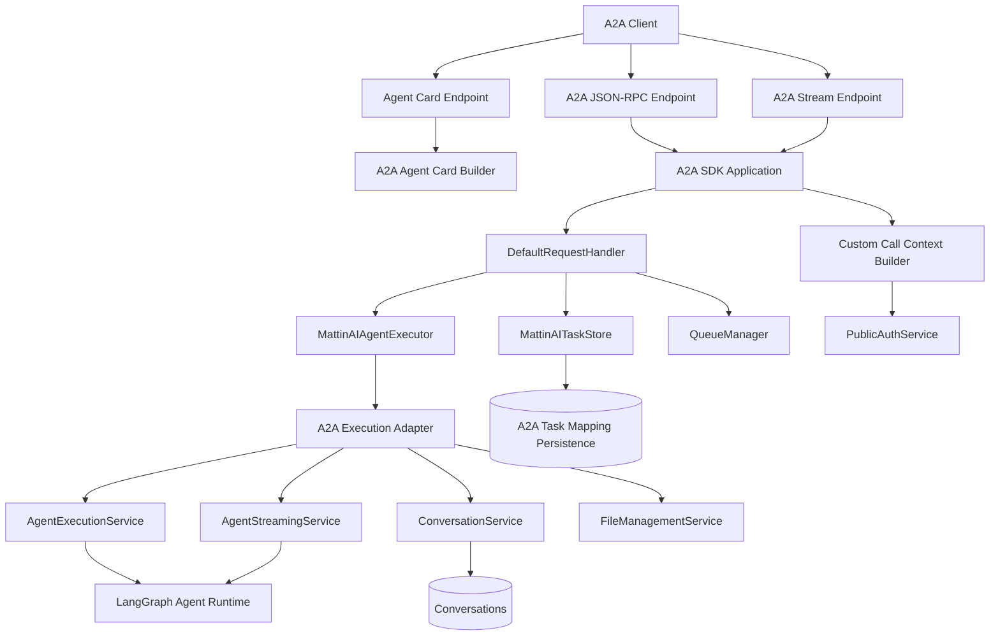
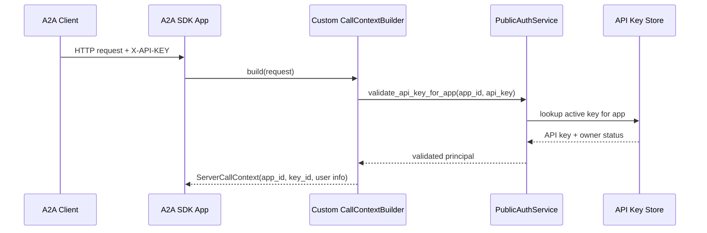
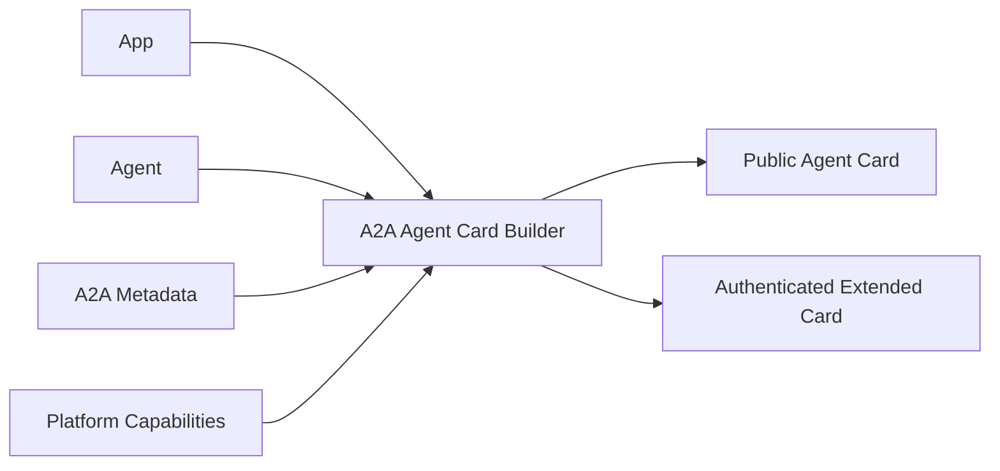
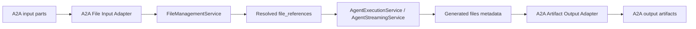
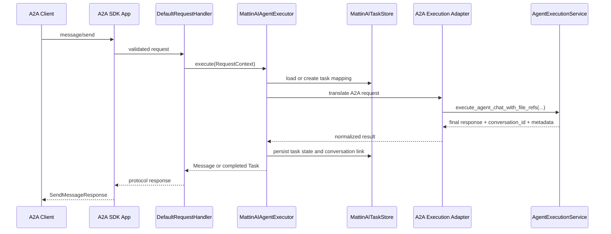
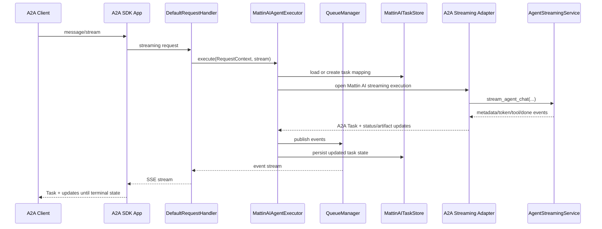
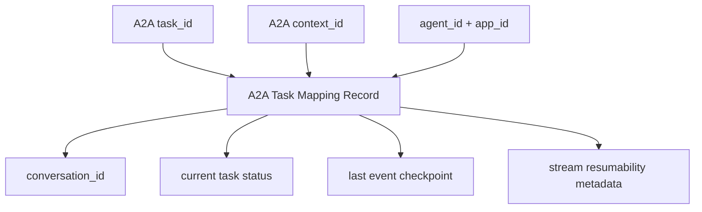

# A2A Integration

> Part of [Mattin AI Documentation](../README.md)

## Overview

This document describes the high-level functional design for exposing **Mattin AI agents as A2A-compatible agents**. The goal is to let external agent platforms discover selected Mattin AI agents through an **Agent Card** and interact with them through the **A2A task/message model**, while reusing Mattin AI's existing agent execution stack.

Mattin AI already exposes agents through:

- Internal web application APIs
- Public API endpoints under `/public/v1/app/{app_id}/...`
- MCP endpoints under `/mcp/v1/*`

This design adds **A2A as another protocol adapter** on top of the same core services, rather than introducing a second execution engine.

## Problem Statement

Today, Mattin AI agents can be called by custom clients through the Public API and can be exposed as tools through MCP. That is useful for direct application integration, but it does not make Mattin AI agents easily discoverable and interoperable for ecosystems that speak **A2A**.

Supporting A2A would allow Mattin AI to:

- Publish selected agents in a protocol that external agent runtimes can discover
- Let external agents call Mattin AI agents without a custom Mattin-specific client
- Reuse current agent configuration, memory, RAG, tools, and streaming behavior
- Position Mattin AI as an interoperable agent platform rather than only an application backend

## Goals

- Expose selected Mattin AI agents as A2A agents
- Provide A2A-compatible discovery through Agent Cards
- Support synchronous and streaming message execution
- Preserve app isolation, authorization, rate limiting, and observability
- Reuse existing `AgentExecutionService` and conversation model
- Minimize changes required in agent authoring and runtime behavior

## Non-Goals

- Replacing the existing Public API or MCP interfaces
- Rewriting agent execution for A2A-specific internals
- Full implementation of every optional A2A feature in the first iteration
- Solving cross-instance federation, agent marketplaces, or registry hosting in phase 1
- Adding a new agent-definition model separate from the current `Agent` entity

## Functional Summary

At a high level, the feature works like this:

1. An app owner explicitly marks one or more Mattin AI agents as **A2A-exposed**.
2. Mattin AI publishes an **Agent Card** for each exposed agent.
3. An external A2A client fetches the Agent Card and learns:
   - who the agent is
   - what skills it offers
   - how to authenticate
   - which interfaces it supports
4. The client sends A2A messages to the Mattin AI A2A endpoint.
5. Mattin AI translates the A2A request into the existing internal agent execution flow.
6. The response is converted back into A2A task, message, and streaming event formats.

## Proposed User Experience

### For Mattin AI app owners

App owners should be able to:

- enable or disable A2A exposure for an agent
- define A2A-facing metadata such as public name, description, and skill summary
- choose which agents are externally discoverable
- control authentication requirements for A2A access

Phase 1 should prefer **explicit opt-in per agent**. This is safer than exposing all public agents automatically and makes multi-tenant behavior easier to reason about.

### For external A2A clients

External clients should be able to:

- fetch an Agent Card from a stable HTTP endpoint
- inspect supported capabilities such as streaming
- send a message to start a task
- continue a multi-turn interaction using the task/context identifiers returned by Mattin AI
- receive final output either synchronously or as a stream of incremental updates

## Proposed Architecture

### Design Principle

The A2A layer should be implemented as a **thin protocol adapter**:

```text
A2A Client
    ↓
A2A Router / Adapter
    ↓
A2A Mapping Layer
    ↓
AgentExecutionService / AgentStreamingService
    ↓
Existing Mattin AI capabilities
```

This mirrors the current pattern already used by:

- the Public API for direct HTTP access
- the MCP router for protocol-specific exposure over shared services

### Technical Decision: Use the Official Python A2A SDK

Mattin AI should implement protocol support using the **official Python A2A SDK** (`a2a-sdk`) rather than building the A2A protocol layer manually.

This means:

- the A2A router should use SDK-provided request and response models where practical
- Agent Cards should be generated using the SDK's canonical types
- protocol validation, task/message schemas, and transport semantics should align with the SDK's implementation model
- Mattin AI-specific behavior should live in adapter code around the SDK, not in a custom protocol reimplementation

#### Why this is the preferred approach

- **Protocol correctness**: reduces the risk of drifting from the official A2A specification
- **Lower maintenance cost**: protocol evolution is absorbed primarily through SDK upgrades instead of custom code
- **Faster delivery**: the team can focus on mapping Mattin AI agents to A2A concepts rather than implementing low-level protocol details
- **Interoperability**: using the official SDK improves compatibility expectations for external A2A clients

#### What remains custom in Mattin AI

Using the SDK does not remove the need for Mattin-specific integration logic. Mattin AI will still need custom code for:

- app and agent resolution
- API-key or future OAuth authentication mapping
- mapping A2A task/context identifiers to Mattin AI `conversation_id`
- translating internal streaming events to A2A streaming events
- building Agent Card metadata from Mattin AI agent configuration
- enforcing app isolation, rate limits, and logging

#### Consequences and tradeoffs

- Mattin AI becomes partially coupled to the SDK's abstractions and release cadence
- SDK upgrades should be treated as compatibility-sensitive changes and validated in integration tests
- if Mattin AI needs behavior not directly modeled by the SDK, that behavior should be implemented in adapter layers instead of forking protocol types

#### Implementation guidance

For phase 1, the implementation should prefer:

- SDK-native server types and message/task schemas
- FastAPI-compatible SDK integration points where available
- a thin `A2AExecutionAdapter` layer that bridges SDK request objects to `AgentExecutionService` and `AgentStreamingService`
- minimal direct protocol serialization logic outside the SDK

### SDK Integration Model

The official SDK should not sit beside Mattin AI as an isolated mini-server. It should be treated as the **protocol-facing shell** for a Mattin AI-backed execution path.

In practice, the recommended runtime layering is:



This structure keeps the responsibilities clean:

- the SDK owns protocol parsing, response models, and stream framing
- Mattin AI owns authentication, agent lookup, execution, memory, tenancy, and persistence
- the adapter layer translates between the two worlds

### SDK Component Mapping to Mattin AI

The following mapping is the key design decision for a maintainable integration:

| A2A SDK concept | Mattin AI integration point | Responsibility in Mattin AI |
|---|---|---|
| `A2AFastAPIApplication` | mounted into the existing FastAPI backend | exposes A2A JSON-RPC endpoints and discovery URLs |
| `A2ARESTFastAPIApplication` | optional later phase | adds REST binding if needed after JSON-RPC is stable |
| `CallContextBuilder` | custom Mattin AI implementation | builds tenant-aware and auth-aware request context from incoming HTTP requests |
| `AgentCard` | `A2AAgentCardBuilder` over `App` + `Agent` | creates public and authenticated agent metadata |
| `DefaultRequestHandler` | reused from SDK | orchestrates protocol methods such as `message/send`, `message/stream`, `tasks/get`, `tasks/cancel`, `tasks/resubscribe` |
| `AgentExecutor` | `MattinAIAgentExecutor` | converts A2A requests into Mattin AI execution calls |
| `RequestContext` | translated into internal execution inputs | carries task ID, context ID, metadata, message content, and auth context |
| `TaskStore` | custom persistent implementation | stores A2A task state and links it to Mattin AI conversations |
| `TaskManager` / `ResultAggregator` | reused from SDK | constructs and updates task state from executor events |
| `QueueManager` | SDK-managed runtime queue | enables active stream delivery and task resubscription |
| push notification stores/senders | deferred for later phase | not required for the first release unless explicitly requested |

### Preferred Binding Strategy

The SDK supports multiple server bindings, but Mattin AI should adopt them in a deliberate order:

1. **Primary binding for phase 1**: JSON-RPC over HTTP using the SDK's FastAPI application support.
2. **Streaming for phase 1**: SSE through the SDK's streaming request handling.
3. **Optional later binding**: REST via the SDK's REST FastAPI application once the JSON-RPC mapping is proven stable.

This sequencing fits the current Mattin AI backend well because:

- the existing backend is already FastAPI-based
- streaming is already modeled with SSE in the Public API
- MCP already gives the team experience with protocol adapters on top of shared services

### How the SDK Fits into `backend/main.py`

The recommended design is to treat the SDK application as a mounted or attached sub-application within the main backend service, not as a separate deployment unit.

Conceptually:

- `backend/main.py` continues to own the global FastAPI process
- the A2A SDK application is attached under an A2A-specific route prefix
- Mattin AI services, repositories, auth, logging, and DB session management remain shared with the rest of the backend

This is preferable to running a second standalone A2A service because it:

- avoids duplicate configuration and deployment concerns
- reuses the same DB, auth model, and observability stack
- reduces drift between Public API and A2A behavior

### Request Context Construction

One of the most important integration points is the SDK's `CallContextBuilder`.

Mattin AI should provide a **custom call-context builder** rather than relying only on the SDK default, because A2A requests need tenant-aware and auth-aware enrichment before they reach execution.

The custom builder should:

- extract app and agent identity from the request path or mounted endpoint configuration
- read the `X-API-KEY` header in phase 1
- validate the key against the app using the current `PublicAuthService`
- attach the resolved `app_id`, `api_key_id`, and derived user context into the A2A server call context
- expose enough context for downstream logging and access control

This keeps A2A auth behavior aligned with the existing Public API instead of inventing a parallel credential model.



### Agent Card Construction Flow

The SDK expects canonical `AgentCard` objects, but Mattin AI should continue to own how those cards are derived from platform data.

Recommended card-generation inputs:

- `App`: base URL context, tenant identity, allowed exposure mode
- `Agent`: name, description, memory support, tool behavior, visibility flags
- A2A-specific metadata: skill tags, examples, public override fields
- platform capability settings: streaming support, task history support, authenticated extended card availability

Recommended separation:

- **public card**: minimal discovery metadata safe for unauthenticated access
- **authenticated extended card**: richer metadata only if the deployment requires it



### Executor Design

The center of the integration is a Mattin AI implementation of the SDK `AgentExecutor` interface.

The executor should not contain core agent business logic. Instead, it should:

- translate A2A `RequestContext` into Mattin AI execution inputs
- decide whether the request is blocking or streaming
- call the existing execution services
- emit SDK-native task, message, and artifact events
- delegate cancellation and resubscription state to the SDK handler and task persistence layer

The executor is therefore a **bridge**, not a second orchestration engine.

### Request Translation Responsibilities

The `MattinAIAgentExecutor` should translate the following fields:

| A2A input | Mattin AI target |
|---|---|
| `task_id` | existing A2A task mapping record |
| `context_id` | conversation grouping or session continuity key |
| input message text | `message` |
| file or artifact parts | phase-1 mapping to uploads and `file_references` |
| request metadata | `user_context` enrichment |
| authenticated caller context | app-scoped execution identity |

The adapter should produce:

- `agent_id`
- `message`
- `conversation_id` when continuing an existing task
- `user_context`
- resolved file references and uploaded-file metadata in phase 1

### File Input and Output in Phase 1

Phase 1 should include **file input and file output support**, not only plain text.

This is feasible because Mattin AI already has the main platform building blocks:

- uploaded-file resolution through `FileManagementService`
- file-aware execution through `execute_agent_chat_with_file_refs(...)`
- generated file metadata in the final streaming response
- OCR, media, and document-processing capabilities already present elsewhere in the platform

The A2A adapter should therefore treat file handling as a first-class phase-1 concern:

- incoming A2A file or artifact references are resolved into Mattin AI file uploads or file references
- those files are attached to the execution request before the agent runs
- generated files are converted back into A2A artifacts in the final task result



The main design implication is that phase 1 is no longer "chat only". It is a **chat plus artifacts** integration built on top of Mattin AI's existing file pipeline.

### Non-Streaming Request Lifecycle

For `message/send`, the recommended integration flow is:



The important design implication is that the SDK should still own the outer request lifecycle, while Mattin AI owns the inner execution lifecycle.

### Streaming Request Lifecycle

For `message/stream`, the shape is similar, but the executor must emit a sequence of A2A events rather than one final result.



This is where the SDK adds real value: it standardizes the outer task stream while Mattin AI only has to map its internal SSE event model into A2A events.

### Event Translation Strategy

Mattin AI already emits internal SSE event types such as:

- `metadata`
- `thinking`
- `tool_start`
- `tool_end`
- `token`
- `done`
- `error`

The A2A integration should translate those into SDK-native responses according to the following design:

| Mattin AI event | A2A-facing effect |
|---|---|
| `metadata` | create initial task or establish task context |
| `thinking` | optional status update with human-readable progress |
| `tool_start` / `tool_end` | status update, not a public low-level tool protocol |
| `token` | aggregated into message content or partial artifact updates |
| `done` | terminal task completion with final text plus file artifacts |
| `error` | failed task state |

The translation layer should avoid exposing Mattin-internal event vocabulary directly to A2A clients.

### Task Persistence and Conversation Mapping

The SDK expects a `TaskStore`, and Mattin AI already persists conversations. Those are related, but they are not the same thing.

Recommended design:

- keep Mattin AI conversation persistence as the source of truth for memory
- add an A2A task persistence layer as the source of truth for protocol task identity
- store a mapping from `a2a_task_id` and `a2a_context_id` to Mattin AI `conversation_id`

This avoids forcing the conversation model to carry all A2A protocol state directly.



The mapping layer should support:

- first message without an existing task
- follow-up messages to an active task
- task lookup
- cancellation
- streaming resubscription where supported

### Task State Ownership

Task state should be split intentionally between the SDK and Mattin AI:

- **SDK-owned runtime state**: in-flight event handling, request method semantics, result aggregation, resubscription queue behavior
- **Mattin-owned persisted state**: mapping to conversations, auth-scoped ownership, long-lived task metadata, audit fields

This division minimizes custom protocol code while preserving Mattin-specific operational guarantees.

### Cancellation Model

The SDK exposes task cancellation through `tasks/cancel`, which means Mattin AI should define a clear cancellation behavior even if underlying LLM runs are not always interruptible at the provider level.

Recommended phase-1 semantics:

- accept cancel requests for active A2A tasks
- mark the persisted A2A task as cancel-requested or canceled
- stop streaming delivery if the execution path supports interruption
- if the underlying provider cannot be interrupted immediately, reflect best-effort cancellation and prevent further task continuation after terminalization

This should be documented as **best-effort cancellation** unless lower-level execution guarantees are introduced later.

### Resubscription Model

The SDK provides `tasks/resubscribe`, which is a strong fit for long-running streamed tasks. However, reliable resubscription depends on how long Mattin AI preserves per-task stream state.

Recommended phase-1 posture:

- support resubscription only for active tasks still tracked by the SDK queue and task mapping
- do not promise full event replay after disconnection
- document that clients may receive only subsequent events after resubscription

This aligns with the A2A specification, which leaves missed-event recovery behavior implementation-defined.

### Artifact Support Strategy

Mattin AI already supports files and structured outputs, and phase 1 should expose a practical subset of that capability through A2A.

For deeper integration planning, the architecture should assume three artifact tiers:

1. **Phase 1**: file inputs and file outputs backed by Mattin-managed uploads, references, and generated file metadata
2. **Phase 2**: richer structured-output artifacts and more complete artifact typing
3. **Phase 3**: richer multi-part inputs and outputs with bidirectional artifact references and broader replay semantics

This is why `FileManagementService` remains inside the phase-1 adapter boundary rather than being postponed.

### Observability Boundaries

The SDK integration should emit observability at two different layers:

- **protocol layer**: A2A method, task ID, context ID, stream/open/close, protocol errors
- **platform layer**: app ID, agent ID, API key ID, conversation ID, execution latency, underlying agent result

This dual view is important because A2A support introduces a new external protocol, but the business and tenancy model still belongs to Mattin AI.

### Main Components

#### 1. A2A Router

A new router group should expose A2A endpoints, for example under:

- `/a2a/v1/...` for protocol operations
- a well-known Agent Card endpoint for discovery

The router is responsible for:

- request authentication
- protocol validation
- HTTP/SSE transport handling
- mapping protocol payloads to internal service calls

#### 2. Agent Card Builder

A dedicated service should transform a Mattin AI `Agent` into an A2A Agent Card.

The Agent Card should be built from:

- `Agent.name`
- `Agent.description`
- app-level URL information
- agent memory and streaming capabilities
- optional curated A2A skill metadata
- selected authentication scheme

This service should avoid leaking internal-only configuration such as raw prompts, private resource IDs, or secrets.

#### 3. A2A Execution Adapter

An adapter service should translate:

- A2A message input to `execute_agent_chat_with_file_refs(...)`
- A2A streaming requests to `AgentStreamingService`
- A2A task/context identifiers to Mattin AI conversation identifiers

This keeps the protocol-specific logic isolated from the core execution flow.

## Discovery Model

### Agent Card exposure

Each A2A-enabled Mattin AI agent should expose one Agent Card. That keeps discovery simple and aligns well with the current agent-centric execution model.

Recommended phase 1 discovery model:

- one Agent Card per exposed agent
- one stable URL per agent
- optional app-level listing endpoint for convenience, but not required for protocol compliance

### URL strategy

Mattin AI already has an app slug but no agent slug in the current model. Because of that, the simplest initial URL scheme is:

- human-readable app identifier where available
- numeric `agent_id` for the agent endpoint

Example shape:

```text
/.well-known/a2a/apps/{app_slug}/agents/{agent_id}/agent-card.json
/a2a/v1/apps/{app_slug}/agents/{agent_id}
/a2a/v1/id/{app_id}/agents/{agent_id}
```

If product requirements later demand cleaner URLs, an agent slug can be added as a follow-up enhancement.

## Capability Mapping

The A2A surface should map Mattin AI concepts to A2A concepts as follows:

| Mattin AI | A2A |
|----------|-----|
| Agent | Agent Card + skills |
| Conversation | Context / task continuity |
| `conversation_id` | Task or context linkage |
| SSE token stream | Streaming task/message updates |
| Final assistant response | Final task result / artifact |
| Agent description | Agent + skill description |

### Skills

Each exposed Mattin AI agent should publish at least one A2A skill derived from the agent's purpose. In phase 1, a single skill per agent is enough:

- `id`: stable value derived from the agent ID
- `name`: based on agent name
- `description`: based on agent description
- `tags`: derived from app-managed metadata when available
- `examples`: optional curated examples

Later phases can support multiple explicit skills per agent if product needs justify it.

### Input and output modes

Phase 1 should support:

- input: text plus files
- output: text plus generated file artifacts

The initial file scope should reuse existing Mattin AI capabilities for uploaded documents, images, and other supported files. Richer artifact typing and broader structured-output support can still be layered in later without changing the core phase-1 decision.

## Interaction Model

### Synchronous execution

For non-streaming calls:

1. client sends an A2A message to the A2A endpoint
2. Mattin AI resolves the target app and agent
3. Mattin AI validates access and rate limits
4. request is mapped to `AgentExecutionService`
5. response is returned as an A2A-compatible result

This path should be used for short-running tasks and for clients that do not require live token updates.

### Streaming execution

For streaming calls:

1. client sends a streaming A2A request
2. Mattin AI starts the agent through `AgentStreamingService`
3. internal token/tool/thinking events are translated into A2A streaming events
4. final completion is emitted as the terminal task event

This is a strong fit for Mattin AI because the platform already supports SSE streaming in the Public API.

### Multi-turn continuity

Mattin AI conversations already provide the foundation for multi-turn interactions.

Recommended mapping:

- A2A task continuity maps to an existing Mattin AI `conversation_id`
- the adapter stores the A2A-visible task identifier and links it to the conversation
- subsequent messages reuse that mapping

This avoids duplicating memory state outside the current conversation system.

In SDK terms, this means:

- `RequestContext.task_id` identifies the A2A task
- `RequestContext.context_id` groups related exchanges
- the Mattin AI adapter resolves both into the correct `conversation_id`
- `TaskStore` persistence ensures later `tasks/get`, `tasks/cancel`, and `tasks/resubscribe` calls are routed to the same execution lineage

## Authentication and Authorization

### Baseline approach

Phase 1 should reuse the existing **app-scoped API key model** used by the Public API.

That means:

- Agent Card discovery may be public or protected, depending on exposure mode
- A2A invocation requires credentials scoped to the target app
- access checks remain app-aware and agent-aware
- existing rate limiting and allowed-origin controls can be reused where appropriate

### Why this is the safest first step

- It matches current operational patterns
- It avoids introducing a second auth stack in the first release
- It preserves multi-tenant isolation
- It reduces rollout risk

### Future auth options

Later phases may add:

- OAuth2 or OIDC-backed A2A authentication
- authenticated extended Agent Cards
- partner-specific discovery policies

## Data and Configuration Changes

The current `Agent` model does not appear to include A2A-specific configuration. Phase 1 will likely need a small amount of new metadata, either directly on `Agent` or in a dedicated profile table.

Suggested minimal configuration:

- `a2a_enabled`
- `a2a_name_override` or public display name
- `a2a_description_override`
- `a2a_skill_tags`
- `a2a_examples`
- `a2a_visibility` or discovery policy

This keeps the exposure decision explicit and avoids coupling A2A publication to unrelated flags such as marketplace visibility.

## API Surface Proposal

The exact route names can change, but the feature should expose three logical surfaces:

### 1. Discovery

- fetch Agent Card for an exposed agent
- optionally fetch an authenticated extended Agent Card

### 2. Invocation

- send message
- send streaming message
- get task state for long-running interactions
- optionally cancel task

### 3. Administration

Internal APIs and UI settings to:

- enable A2A on an agent
- manage agent-facing metadata
- inspect exposure state

## Error Handling

The A2A adapter should translate Mattin AI runtime failures into protocol-appropriate errors while preserving useful operational diagnostics in logs.

Common error categories:

- app or agent not found
- agent not exposed through A2A
- authentication failure
- authorization failure
- rate limit exceeded
- invalid protocol payload
- execution failure in the underlying agent runtime

## Observability

The feature should integrate with existing logging and usage tracking. At minimum, each A2A request should log:

- app ID
- agent ID
- auth principal or API key ID
- protocol method
- task or conversation ID
- latency and outcome

This allows A2A traffic to be measured separately from Public API and MCP traffic.

## Rollout Plan

### Phase 1

- expose selected agents through an A2A HTTP interface
- publish one Agent Card per exposed agent
- support text and file input/output
- support synchronous and SSE streaming execution
- map task continuity to existing conversations
- reuse API key authentication

### Phase 2

- add richer skill metadata management
- add extended Agent Cards
- add task lookup and cancellation
- improve structured-output artifacts and richer artifact typing

### Phase 3

- add stronger discovery options and registry integration
- add OAuth2/OIDC support where required
- consider partner-specific exposure controls and policy enforcement

## Risks and Tradeoffs

- **Protocol mismatch risk**: A2A task semantics are broader than Mattin AI's current chat-centric Public API. The adapter must define clear mappings for task state and continuity.
- **Exposure risk**: Automatic publication of agents could leak capabilities unintentionally. Explicit opt-in reduces this risk.
- **Metadata quality risk**: Agent Cards are only useful if names, descriptions, and skills are curated well enough for discovery.
- **Scope risk**: Supporting files, artifacts, push notifications, and every optional method in phase 1 could slow delivery significantly.

## Open Design Decisions

The following items should be confirmed before implementation starts:

1. Should A2A exposure be enabled per agent, per app, or both?
2. Should Agent Card discovery be public, authenticated, or configurable per agent?
3. Which file types must be guaranteed in phase 1, and which can be best-effort or deferred?
4. Should Mattin AI expose one A2A agent per Mattin AI agent, or also support an app-level broker/dispatcher agent?
5. Is API-key authentication enough for the first release, or is OAuth2/OIDC required from day one?
6. Do we need JSON-RPC binding, REST binding, or both in the first release?

## Recommended First Implementation Decision Set

If no stronger product requirement exists, the recommended implementation baseline is:

- one A2A agent per Mattin AI agent
- explicit per-agent opt-in
- public or minimally protected Agent Card discovery
- API-key authentication for invocation
- official Python `a2a-sdk` used for protocol support
- SDK `CallContextBuilder`, `AgentExecutor`, and `TaskStore` customized for Mattin AI tenancy and conversation mapping
- text and file input/output in phase 1
- streaming support included in phase 1
- JSON-RPC over HTTP with SSE on top of the existing FastAPI stack

## References

- Mattin AI [Agent System](agent-system.md)
- Mattin AI [MCP Integration](mcp-integration.md)
- Mattin AI [Public API](../api/public-api.md)
- A2A Protocol specification: https://a2a-protocol.org/latest/specification/
- A2A Python SDK docs (`a2a-sdk`): https://a2a-protocol.org/latest/sdk/python/api/
- A2A Python Agent Executor tutorial: https://a2a-protocol.org/latest/tutorials/python/4-agent-executor/
