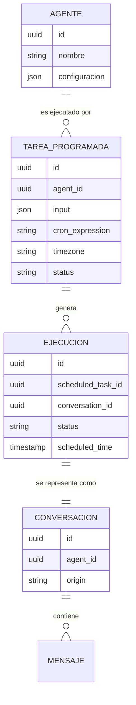
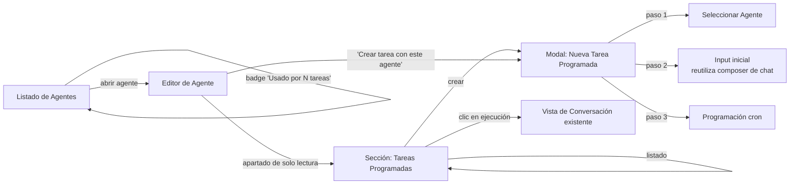

# Documento de cambios: Tareas Programadas en Mattin AI

**Afecta a:**
- "Diseño técnico: Agentes periódicos en Mattin AI sobre DBOS" (backend)
- "Diseño UI: Programación periódica de agentes y seguimiento de ejecuciones" (frontend)

**Naturaleza del cambio:** conceptual y estructural — no es un ajuste menor, cambia la entidad principal del dominio para esta funcionalidad.
**Estado de la implementación previa:** ninguna fase se ha ejecutado aún (diseño en fase de propuesta), por lo que este documento sustituye las secciones afectadas de ambos diseños en lugar de describir una migración de datos en producción.

---

## 1. Resumen del cambio

El diseño original programaba directamente el **Agente**: un `agent_schedule` colgaba del agente y se gestionaba desde su propio editor. Se introduce ahora un cambio de modelo con tres reglas:

1. **El concepto de Agente no se modifica.** Un agente sigue siendo lo que ya es hoy en Mattin AI (LLM + RAG + Skills + MCP), sin ningún atributo nuevo de programación.
2. **Se introduce un nuevo concepto de primer nivel: la Tarea Programada** (`ScheduledTask`). Una Tarea Programada es una entidad independiente que **referencia** a un agente y define: qué agente ejecutar, con qué input, y con qué periodicidad. La relación pasa de "el agente tiene una programación" a "una tarea programada usa un agente".
3. **El resultado de cada ejecución se representa como una conversación**, con el mismo formato con el que ya se renderizan las interacciones de chat en Mattin AI (markdown, bloques de código, citas, resultados de herramientas, etc.), en lugar de un resumen de resultado propio de esta funcionalidad.

### 1.1 Por qué este cambio es más que un rename

No es simplemente sustituir el nombre de una tabla. Tiene tres consecuencias reales:

- **Una Tarea Programada puede reutilizar el mismo agente varias veces** con inputs y periodicidades distintas (ej. "Agente de reporting" ejecutado cada mañana con un input, y cada viernes con otro), sin que el agente "sepa" nada de esas programaciones.
- La gestión de programaciones deja de vivir dentro del editor de un agente concreto y pasa a ser **su propia área de la aplicación**, con su propio listado, ciclo de vida y permisos.
- El resultado de una ejecución deja de ser un "resumen técnico" (JSON, texto plano) y pasa a ser **una conversación real, navegable e igual de rica visualmente que cualquier chat** — el usuario revisa una ejecución periódica exactamente igual que revisaría una conversación que hubiera tenido él mismo con el agente.

---

## 2. Modelo conceptual actualizado



**Nota de diseño:** se asume que Mattin AI ya dispone de un modelo de dominio de Conversación/Mensaje para las interacciones de chat con agentes (es la base de la experiencia conversacional actual de la plataforma). Este diseño **reutiliza ese modelo tal cual**, sin proponer un modelo de conversación nuevo. Si el modelo real de conversaciones existente tiene restricciones no contempladas aquí (p. ej. una conversación exige que el primer mensaje lo origine un usuario humano autenticado), es necesario validarlo con el equipo propietario de ese módulo antes de la Fase 2 de implementación — ver §5.

---

## 3. Cambios en el diseño de backend

### 3.1 Modelo de datos

**Se sustituye** `agent_schedules` por `scheduled_tasks`, con un cambio de forma, no solo de nombre: ya no es un registro "colgado" del agente vía `agent_id` como clave semánticamente débil, sino la entidad principal de la funcionalidad.

```sql
CREATE TABLE scheduled_tasks (
    id UUID PRIMARY KEY DEFAULT gen_random_uuid(),
    name TEXT NOT NULL,                                -- nombre visible de la tarea, distinto del nombre del agente
    agent_id UUID NOT NULL REFERENCES agents(id) ON DELETE CASCADE,
    workspace_id UUID NOT NULL REFERENCES workspaces(id) ON DELETE CASCADE,
    created_by UUID NOT NULL REFERENCES users(id),
    orchestrator_schedule_name TEXT NOT NULL UNIQUE,   -- f"scheduled-task-{id}"
    input JSONB NOT NULL,                              -- input que se envía al agente en cada ejecución (equivalente al primer mensaje/parámetros de un chat)
    cron_expression TEXT NOT NULL,
    timezone TEXT NOT NULL DEFAULT 'UTC',
    conversation_mode TEXT NOT NULL DEFAULT 'new_per_run', -- 'new_per_run' | 'continuous' — elegido por el usuario al crear la tarea, ver 3.2.1
    persistent_conversation_id UUID REFERENCES conversations(id), -- solo se rellena si conversation_mode = 'continuous'; se crea de forma perezosa en la primera ejecución y se reutiliza en las siguientes
    status TEXT NOT NULL DEFAULT 'active',              -- active | paused | deleted
    max_concurrent_runs INTEGER NOT NULL DEFAULT 1,
    created_at TIMESTAMPTZ NOT NULL DEFAULT now(),
    updated_at TIMESTAMPTZ NOT NULL DEFAULT now()
);
```

**Se sustituye** `agent_run_summary` por `scheduled_task_runs`, que ya no almacena un resumen de resultado propio: almacena la referencia a la conversación generada.

```sql
CREATE TABLE scheduled_task_runs (
    id UUID PRIMARY KEY DEFAULT gen_random_uuid(),
    scheduled_task_id UUID NOT NULL REFERENCES scheduled_tasks(id) ON DELETE CASCADE,
    conversation_id UUID NOT NULL REFERENCES conversations(id),  -- en modo 'continuous' es SIEMPRE la misma para todas las ejecuciones de la tarea; en modo 'new_per_run' es una conversación distinta por ejecución
    conversation_anchor_message_id UUID REFERENCES messages(id), -- primer mensaje que esta ejecución concreta añadió a la conversación; permite enlazar directamente al tramo de esta ejecución dentro de una conversación continua (ver 4.3)
    orchestrator_run_id TEXT NOT NULL,
    scheduled_time TIMESTAMPTZ NOT NULL,
    started_at TIMESTAMPTZ,
    finished_at TIMESTAMPTZ,
    status TEXT NOT NULL,   -- queued | running | succeeded | failed | retrying
    attempt_count INTEGER NOT NULL DEFAULT 0,
    error_summary TEXT      -- se mantiene SOLO para el caso de fallo (cuando puede no existir conversación completa que mostrar)
);

CREATE INDEX idx_scheduled_task_runs_task ON scheduled_task_runs(scheduled_task_id, scheduled_time DESC);
```

Se elimina `output_summary`: ya no tiene sentido guardar un resumen del resultado en esta tabla, porque el resultado completo y navegable ya vive en `conversations`/`messages`. `error_summary` se mantiene como caso especial para cuando la ejecución falla antes de producir una conversación completa (p. ej. error de validación de input antes de invocar al agente).

### 3.2 Workflow DBOS actualizado

El workflow pasa a operar sobre `scheduled_task_id` en vez de `agent_schedule_id`, y su responsabilidad central cambia: en vez de invocar "la lógica de ejecución de un agente" y quedarse con un resultado propio, invoca **la misma vía de ejecución que ya usa el chat interactivo**, de forma que el resultado nazca ya como una conversación.

```python
# backend/scheduling/periodic_task_workflow.py
from datetime import datetime
from dbos import DBOS

@DBOS.step(retries_allowed=True, max_attempts=3, interval_seconds=5, backoff_rate=2.0)
async def invoke_agent_as_conversation_step(agent_id: str, workspace_id: str, input: dict, conversation_id: str):
    # Reutiliza el mismo servicio que procesa un turno de chat interactivo,
    # de forma que el resultado se persiste como mensajes de una conversación
    # con el mismo formato (markdown, citas, resultados de tools, etc.)
    return await conversation_service.run_agent_turn(
        agent_id=agent_id,
        workspace_id=workspace_id,
        conversation_id=conversation_id,
        input=input,
        origin="scheduled_task",  # distingue el origen del turno sin cambiar su formato
    )


@DBOS.workflow(max_recovery_attempts=3)
async def periodic_task_run(scheduled_time: datetime, actual_time: datetime, scheduled_task_id: str):
    task = await scheduled_task_repo.get(scheduled_task_id)

    if task.conversation_mode == "continuous":
        # Se crea UNA SOLA VEZ, en la primera ejecución, y se reutiliza en todas
        # las siguientes. get_or_create es idempotente frente a reintentos del propio step.
        conversation = await conversation_service.get_or_create_persistent_conversation(
            scheduled_task_id=task.id, agent_id=task.agent_id, workspace_id=task.workspace_id,
        )
    else:  # "new_per_run"
        conversation = await conversation_service.create_conversation(
            agent_id=task.agent_id, workspace_id=task.workspace_id, origin="scheduled_task",
        )

    run = await scheduled_task_run_service.start_run(
        scheduled_task_id=scheduled_task_id,
        conversation_id=conversation.id,
        orchestrator_run_id=DBOS.workflow_id,
        scheduled_time=scheduled_time,
    )

    try:
        # En modo 'continuous', run_agent_turn recibe el conversation_id de una
        # conversación con histórico: el servicio de conversación YA construye el
        # contexto del agente incluyendo los turnos anteriores, exactamente igual
        # que en un chat interactivo multi-turno — no se necesita lógica adicional
        # para "pasar el histórico", es la misma conversación la que lo aporta.
        result = await invoke_agent_as_conversation_step(
            agent_id=task.agent_id,
            workspace_id=task.workspace_id,
            input=task.input,
            conversation_id=conversation.id,
        )
        await scheduled_task_run_service.mark_succeeded(
            run.id, conversation_anchor_message_id=result.first_message_id,
        )

    except Exception as exc:
        await scheduled_task_run_service.mark_failed(run.id, error=str(exc))
        raise
```

#### 3.2.1 Modo de conversación: configurable por el usuario al crear la tarea

Se resuelve la decisión abierta en la versión anterior de este documento: en lugar de que el equipo de producto elija un único comportamiento fijo, **el modo de conversación es un campo del formulario de creación de la Tarea Programada** (`conversation_mode`, ver §4.1):

| Valor | Comportamiento | Cuándo tiene sentido |
|---|---|---|
| **`new_per_run`** (valor por defecto) | Cada disparo del cron crea una conversación independiente, sin memoria de ejecuciones anteriores | Análisis autocontenidos (ej. "informe diario de ventas", donde cada día es independiente) |
| **`continuous`** | Todas las ejecuciones de la tarea añaden turnos a **una única conversación persistente**; el agente recibe el histórico completo de ejecuciones anteriores como contexto de la conversación, igual que en un chat multi-turno normal | Seguimiento evolutivo (ej. "monitoriza este indicador y avísame si cambia respecto a la última vez que lo revisaste") |

**Implicación clave de `continuous`:** el histórico no es un añadido artificial — es simplemente que todas las ejecuciones comparten `conversation_id`, y el mecanismo de contexto multi-turno que ya usa Mattin AI para el chat interactivo se aplica sin cambios. Cada ejecución "ve" lo que el agente respondió en la ejecución anterior de la misma forma en que, en un chat normal, un mensaje ve los anteriores del mismo hilo.

**Riesgo a gestionar, propio de `continuous`:** una conversación que crece indefinidamente con ejecuciones frecuentes (p. ej. cron cada hora, durante meses) aumenta el tamaño del contexto enviado al LLM en cada ejecución, con impacto en coste, latencia y, eventualmente, el límite de contexto del modelo. Se añade como tarea de la Fase 5 (multi-tenancy y límites, documento de backend) definir una **política de ventana de histórico** (por ejemplo, incluir solo las últimas N ejecuciones o los últimos M días en el contexto enviado al agente, mantiendo el resto solo como historial visible pero no como contexto activo). Esta política debe aplicarse dentro de `conversation_service.get_or_create_persistent_conversation` / `run_agent_turn`, sin que el workflow de DBOS necesite conocerla.

**Inmutabilidad tras la creación:** se recomienda que `conversation_mode` **no sea editable** una vez creada la tarea (solo se fija al crearla). Cambiar de `continuous` a `new_per_run` a mitad de vida de una tarea dejaría una conversación persistente "huérfana"; si se necesita ese cambio, la vía recomendada es que el usuario cree una nueva Tarea Programada en el modo deseado y pause/elimine la anterior.

### 3.3 API REST actualizada

Cambia el namespace: las Tareas Programadas dejan de anidarse bajo `/agents/{agent_id}/...` porque ya no son un recurso hijo del agente, sino una entidad propia que referencia a un agente.

| Método | Endpoint anterior | Endpoint actualizado |
|---|---|---|
| `POST` | `/agents/{agent_id}/schedules` | `POST /scheduled-tasks` (con `agent_id` en el body) |
| `GET` | `/agents/{agent_id}/schedules` | `GET /scheduled-tasks?agent_id=...` (filtro opcional) |
| `PATCH` | `/agents/{agent_id}/schedules/{schedule_id}` | `PATCH /scheduled-tasks/{scheduled_task_id}` |
| `DELETE` | `/agents/{agent_id}/schedules/{schedule_id}` | `DELETE /scheduled-tasks/{scheduled_task_id}` |
| `GET` | `/agents/{agent_id}/schedules/{schedule_id}/runs` | `GET /scheduled-tasks/{scheduled_task_id}/runs` |
| — | (no existía) | `GET /scheduled-tasks/{scheduled_task_id}/runs/{run_id}` → devuelve `conversation_id`, para que el frontend redirija a la vista de conversación ya existente |

`AgentSchedulerService` se renombra a `ScheduledTaskService`, manteniendo el mismo principio de aislamiento: es el único punto del backend que conoce el SDK de DBOS.

### 3.4 Impacto en el plan de fases

| Fase (documento original) | Cambio |
|---|---|
| 2. Modelo de datos y servicio adaptador | Se sustituyen las migraciones y el servicio como se describe en §3.1-3.3. Se añade como tarea previa: **validar con el equipo propietario del módulo de Conversaciones** la viabilidad de crear conversaciones con origen `scheduled_task` (sin usuario humano iniciando el turno) — ver §5 |
| 3. API REST | Cambia el namespace de los endpoints; sin cambio en el esfuerzo estimado |
| 4. Frontend | Cambia sustancialmente — ver §4 |
| Resto de fases (0, 1, 5, 6) | Sin cambios de fondo |

---

## 4. Cambios en el diseño de UI

### 4.1 Nueva pantalla de primer nivel: "Tareas Programadas"

Deja de existir como una pestaña dentro del editor de un agente concreto y pasa a ser **una sección propia de la aplicación** (al mismo nivel que "Agentes" en la navegación), reflejando que una Tarea Programada es una entidad independiente:

- **Listado de Tareas Programadas** del workspace: nombre de la tarea, agente que usa, próxima ejecución, estado (activa/pausada), resultado de la última ejecución.
- **Crear Tarea Programada:** formulario con tres bloques, en este orden:
  1. **Selector de agente** (obligatorio, primero — ancla el resto del formulario).
  2. **Input de la tarea:** reutiliza el mismo componente que ya existe para iniciar una conversación con ese agente (el mismo formulario/caja de entrada que se usa en el chat interactivo), en vez de un textarea/JSON genérico. Si el agente admite parámetros estructurados, se reutiliza ese mismo formulario dinámico.
  3. **Modo de conversación** (nuevo campo, ver §3.2.1 del documento de cambios de backend): selector con dos opciones, presentadas en lenguaje natural, no con los nombres técnicos:
     - *"Cada ejecución empieza una conversación nueva"* (opción por defecto, preseleccionada).
     - *"Todas las ejecuciones continúan la misma conversación"* — con un texto de ayuda breve: "El agente verá lo que ocurrió en ejecuciones anteriores, como en una conversación normal."
     - Este campo **no es editable** después de crear la tarea (se muestra como texto fijo, no como control, en la pantalla de edición) — ver justificación en §3.2.1 del documento de backend.
  4. **Programación (cron):** el mismo modo simple/avanzado ya definido en el diseño original (§5.3 del documento de UI original), sin cambios.
- **Pausar / Reanudar / Editar / Eliminar** sobre cada tarea, igual que antes pero a nivel de tarea en vez de a nivel de "programación del agente".

### 4.2 Cambios en el editor de agente

Se elimina la pestaña "Programación" del editor de agente. En su lugar, se añade una referencia ligera y de solo lectura:

- Un apartado **"Tareas Programadas que usan este agente"**: lista breve (nombre + próxima ejecución + estado) con un enlace a cada una en la nueva sección §4.1, y un botón **"Crear tarea programada con este agente"** que abre el formulario de creación de §4.1 con el agente ya preseleccionado.

Esto mantiene un punto de entrada cómodo desde el contexto del agente sin que el agente "posea" la programación.

### 4.3 El historial de ejecuciones se convierte en un listado que abre conversaciones

Cambio central de este documento: el **Detalle de Ejecución** (definido en el diseño de UI original, §5.4, como un panel con metadatos + salida renderizada a medida + botón "ver detalle técnico") **desaparece como componente propio**. Se sustituye por:

- La fila de historial de una ejecución muestra: fecha programada, estado, duración — igual que antes.
- Al hacer clic, la aplicación **navega directamente a la vista de conversación ya existente en Mattin AI** (`conversation_id`), usando el mismo componente de chat que se usa para cualquier conversación interactiva. El usuario ve la ejecución exactamente como vería una conversación que hubiera mantenido él mismo: mismo renderizado de markdown, citas, resultados de Skills/tools, código, etc.
- Si la ejecución falló **antes** de generar una conversación completa (error de validación, timeout de arranque), no hay conversación que abrir: se muestra en su lugar el `error_summary`, igual que antes, en un panel simple (no en el componente de conversación).
- **Comportamiento según el modo de conversación de la tarea (§3.2.1):**
  - En modo `new_per_run`, cada fila del historial abre una conversación distinta — comportamiento ya descrito arriba, sin cambios.
  - En modo `continuous`, **todas las filas del historial de esa tarea apuntan a la misma conversación**. El clic navega a esa conversación posicionada en `conversation_anchor_message_id` (el primer mensaje que esa ejecución concreta añadió), de forma que el usuario aterriza directamente en el tramo relevante en vez de tener que buscarlo dentro de un hilo potencialmente largo. La cabecera de la vista de conversación en este caso muestra además un indicador — "Ejecución programada del [fecha]" — para que quede claro que se está viendo un punto concreto dentro de un histórico continuo, con la opción de desplazarse libremente al resto de la conversación.
  - En el listado de una tarea en modo `continuous`, se añade un acceso directo **"Ver conversación completa"** (sin anclar a ninguna ejecución en particular), útil cuando el usuario quiere revisar la evolución completa en vez de una ejecución puntual.

**Ventaja de este cambio:** se elimina la necesidad de mantener un renderizador de resultados propio para esta funcionalidad (el trabajo de la Fase 5 del plan de UI original, "reutilizar el mismo componente de renderizado de respuesta", pasa de ser una reutilización parcial a una reutilización total de la pantalla de conversación).

### 4.4 Cambios en el listado de Agentes

El badge `⏱ Programado` deja de tener sentido tal como estaba planteado (el agente ya no "está programado"; son las tareas las que lo usan). Se sustituye por un indicador más preciso:

- `🔗 Usado por N tareas programadas` (solo si N > 0), sin indicar estado de esas tareas en el propio badge — el detalle de estado se consulta en la sección §4.1.

### 4.5 Mapa de pantallas actualizado



### 4.6 Plan de implementación (frontend) actualizado

| Fase (documento original) | Cambio |
|---|---|
| 1. Cliente API + tipos | Se actualiza a los nuevos endpoints `/scheduled-tasks` |
| 2. Lista + toggle | Pasa a ser la nueva sección de primer nivel §4.1, no una sub-pestaña del agente |
| 3. Modal de creación/edición | Se añade el paso de selección de agente y se sustituye el input JSON libre por el composer de chat reutilizado |
| 4. Historial de ejecuciones | Sin cambios de estructura, cambia el destino del clic (§4.3) |
| 5. Detalle de ejecución individual | **Se elimina como desarrollo propio** — se sustituye por la navegación a la vista de conversación existente, reduciendo el alcance de esta fase a solo el manejo del caso de fallo previo a conversación |
| 6. Badge en listado de agentes | Cambia el texto/condición, mismo esfuerzo |
| 7. Vista de workspace (opcional) | Sin cambios de fondo — pasa a listar Tareas Programadas en vez de "agentes programados" |

---

## 5. Preguntas abiertas que deben resolverse antes de implementar

1. **¿El modelo de Conversación existente admite un origen `scheduled_task` sin un turno iniciado por un usuario humano?** Es la validación más importante de este cambio — si el módulo de conversaciones asume siempre un usuario humano como emisor del primer mensaje, hay que definir cómo se representa el "input de la tarea programada" dentro de ese modelo (¿como si lo escribiera el usuario que creó la tarea? ¿como un tipo de mensaje de sistema?). Esto aplica igual en modo `new_per_run` y en modo `continuous`.
2. **Política de ventana de histórico para el modo `continuous` (§3.2.1):** qué cantidad de ejecuciones anteriores se incluye como contexto activo del agente a medida que la conversación crece, para controlar coste/latencia/límite de contexto del modelo.
3. **Permisos de visualización:** si una Tarea Programada la crea un usuario pero el agente es compartido en el workspace, ¿quién puede ver las conversaciones resultantes? Debe alinearse con el modelo de permisos ya existente sobre conversaciones, no inventar uno nuevo para esta funcionalidad.
4. **Reutilización real del composer de chat para el input de la tarea (§4.1):** validar con el equipo de frontend si el componente de composer actual se puede usar de forma desacoplada de una sesión de chat activa, o si requiere adaptación.

---

## 6. Resumen de documentos afectados

- El documento de diseño de backend ("Agentes periódicos en Mattin AI sobre DBOS") debe actualizarse sustituyendo sus secciones §5.1 (modelo de datos), §5.4-5.5 (workflow y registro) y §5.6 (API REST) por lo descrito en este documento.
- El documento de diseño de UI ("Programación periódica de agentes y seguimiento de ejecuciones") debe actualizarse sustituyendo sus secciones §4-§5 (listado de agentes y pestaña del editor) y §5.4 (Detalle de Ejecución) por lo descrito en §4 de este documento.
