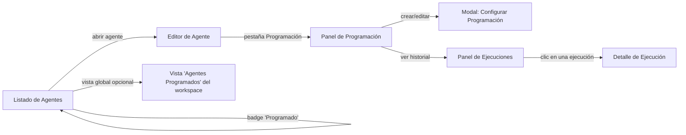

# Diseño UI: Programación periódica de agentes y seguimiento de ejecuciones

**Proyecto:** Mattin AI (`lksnext-ai-lab/ai-core-tools`)
**Frontend:** React + TypeScript
**Depende de:** Diseño técnico "Agentes periódicos en Mattin AI sobre DBOS" (backend)
**Estado:** Superseded — ver `cambios-tareas-programadas.md`

> Este diseño histórico queda sustituido por [`cambios-tareas-programadas.md`](cambios-tareas-programadas.md): las tareas programadas viven en una sección propia y el historial abre conversaciones existentes.

---

## 1. Resumen y alcance

Este documento define los cambios necesarios en el frontend de Mattin AI para que un usuario pueda:

1. Configurar una **programación periódica** (cron) para un agente ya existente, desde el propio editor del agente.
2. Ver de un vistazo, en el listado de agentes, **cuáles están programados** y su próximo disparo.
3. Consultar el **historial de ejecuciones** de un agente programado (estado, duración, errores) sin necesidad de acceder a herramientas internas de infraestructura.
4. **Pausar, reanudar, editar o eliminar** una programación existente.
5. Recibir señales claras de fallo (visual + opcional notificación) cuando una ejecución periódica falla repetidamente.

Todo el diseño se apoya exclusivamente en los endpoints ya definidos en el diseño técnico de backend (`/agents/{id}/schedules`, `/agents/{id}/schedules/{id}/runs`) — la UI nunca habla directamente con el motor de orquestación subyacente.

### 1.1 Fuera de alcance

- Un dashboard de infraestructura de bajo nivel (colas, reintentos, throughput del runtime) — eso queda como herramienta interna de operaciones, no de producto.
- Edición visual de flujos multi-agente encadenados (se limita a la programación de un agente individual).

---

## 2. Usuarios y casos de uso

| Actor | Caso de uso |
|---|---|
| Usuario de negocio que configura agentes | Quiere que un agente de reporting corra "todos los lunes a las 8:00" sin tener que lanzarlo a mano |
| Usuario que revisa resultados | Quiere saber si la última ejecución programada de un agente falló y por qué, sin pedir ayuda a IT |
| Administrador de workspace | Quiere ver de un vistazo qué agentes tienen programaciones activas en su workspace, para controlar consumo |

---

## 3. Mapa de pantallas y puntos de entrada

Se introducen tres puntos de entrada nuevos, sin romper la navegación actual:

1. **Badge en el listado de agentes** (`L`): indicador ligero de que un agente tiene programación activa.
2. **Nueva pestaña "Programación" dentro del editor de agente** (`E → S`): punto principal de gestión.
3. **Vista opcional a nivel de workspace** (`G`): útil para administradores que quieran ver todos los agentes programados sin entrar uno a uno (fase 2, ver §9).

---

## 4. Listado de Agentes — cambios mínimos

- Añadir un **badge de estado de programación** junto al nombre del agente:
  - `⏱ Programado` (verde/neutro) — tiene al menos una programación activa.
  - `⏸ Pausado` (gris) — programación existente pero pausada.
  - `⚠ Falló última ejecución` (ámbar/rojo) — la ejecución más reciente terminó en error.
- El badge es **solo informativo** en esta vista; el clic lleva directamente a la pestaña "Programación" del agente, no despliega acciones aquí (evita sobrecargar una vista que ya lista muchos agentes).

No se requiere columna adicional en vista de tabla si el listado ya usa tarjetas; si usa tabla, añadir una columna "Programación" con el mismo badge.

---

## 5. Pestaña "Programación" (dentro del editor de agente)

Nueva pestaña al mismo nivel que las existentes (ej. "Configuración", "Skills", "Pruebas"). Contiene dos secciones apiladas:

### 5.1 Sección A — Programaciones activas

Lista (normalmente 0 o 1 elemento; se permite más de una programación por agente para casos como "cada hora en horario laboral" + "resumen diario a las 20:00").

Cada fila muestra:

| Elemento | Contenido |
|---|---|
| Expresión legible | "Cada día a las 08:00 (Europe/Madrid)" — **nunca mostrar el cron crudo como texto principal**, solo como detalle expandible/tooltip |
| Estado | Activa / Pausada, con toggle inline |
| Próxima ejecución | Fecha/hora calculada, en la zona horaria del usuario |
| Última ejecución | Estado (icono ✅/❌/🔄) + hace cuánto tiempo, con enlace directo al detalle |
| Acciones | Editar (abre modal §5.3), Pausar/Reanudar (toggle), Eliminar (con confirmación) |

Estado vacío (sin programaciones): mensaje breve + botón primario **"Programar ejecución periódica"**.

### 5.2 Sección B — Historial de ejecuciones

Tabla paginada (o lista infinita) con las últimas ejecuciones de todas las programaciones del agente:

| Columna | Detalle |
|---|---|
| Fecha/hora programada | En zona horaria local del usuario |
| Estado | Badge: `En cola` / `Ejecutando` (con spinner) / `Completado` / `Falló` / `Reintentando (2/3)` |
| Duración | `Iniciado` → `Finalizado`, o "en curso" si sigue activa |
| Resumen | Primeras líneas del resultado, o del error si falló |
| Acción | "Ver detalle" |

Filtros disponibles: por estado (mostrar solo fallos), por rango de fechas.

Refresco: **polling ligero** (ej. cada 10-15s) mientras haya ejecuciones en estado `En cola` o `Ejecutando` visibles en pantalla; sin polling si todo lo visible está en estado terminal, para no generar tráfico innecesario.

### 5.3 Modal "Configurar Programación"

Formulario de creación/edición, con dos modos de entrada para no obligar al usuario a conocer sintaxis cron:

**Modo simple (por defecto):**
- Selector de frecuencia: `Cada X minutos/horas` / `Diariamente` / `Semanalmente (día + hora)` / `Mensualmente (día + hora)`.
- Selector de zona horaria (precargado con la del navegador del usuario, editable).
- Campos adicionales cambian dinámicamente según la frecuencia elegida (ej. si es "Semanalmente", aparece selector de día de la semana).

**Modo avanzado (colapsado, "Usar expresión cron"):**
- Input de texto libre con expresión cron, validación en tiempo real (feedback inmediato: "Próximas 3 ejecuciones: ...") para que el usuario compruebe que ha escrito lo que cree haber escrito, sin necesidad de conocimiento previo de cron.

**Campo común:**
- Contexto de entrada opcional (`input_context`): un textarea/JSON editor simple, solo visible si el agente admite parámetros de entrada configurables. Con validación de formato antes de guardar.

**Validaciones de UI antes de enviar a la API:**
- Frecuencia mínima según el plan del workspace (mensaje explicativo si el usuario intenta configurar algo por debajo del límite, en vez de un error genérico tras el submit).
- Confirmación explícita si se va a **reemplazar** una programación existente en conflicto de horario, no bloqueo silencioso.

Botones: `Cancelar` / `Guardar y activar`. Si es edición de una programación ya pausada, el botón indica `Guardar (permanece pausada)` para no reactivarla por sorpresa.

### 5.4 Detalle de una ejecución individual

Vista (modal o panel lateral) al hacer clic en una fila del historial:

- Metadatos: agente, programación de origen, hora programada vs. hora real de inicio, duración, número de intento (si hubo reintentos).
- Salida completa del agente en esa ejecución (reutilizar el mismo componente de renderizado de respuesta que ya existe para ejecuciones manuales/chat, por consistencia visual).
- Si falló: mensaje de error legible (no traza técnica cruda por defecto; opción "Ver detalle técnico" para usuarios avanzados/soporte).
- Botón **"Volver a ejecutar ahora"** (dispara una ejecución manual inmediata reutilizando el mismo `input_context`, útil para reintentar tras corregir algo) — esto llama al endpoint de ejecución manual ya existente, no crea una programación nueva.

---

## 6. Estados y feedback visual

| Situación | Tratamiento en UI |
|---|---|
| Programación recién creada | Toast de confirmación + fila añadida inmediatamente en Sección A sin esperar refresco |
| Ejecución en curso | Spinner discreto en el badge de "Última ejecución"; no bloquear el resto de la pantalla |
| Fallos consecutivos (≥3 seguidos) | Elevar el badge de "Falló" a un aviso más visible en la cabecera de la pestaña (no solo en la fila), sugiriendo revisar la configuración del agente |
| Programación pausada manualmente | Fila atenuada (opacidad reducida), badge gris, sin mostrar "próxima ejecución" |
| Workspace sin permisos de programación (según plan) | La pestaña "Programación" sigue visible pero en modo informativo, con CTA hacia upgrade de plan en vez de ocultarse por completo |

---

## 7. Accesibilidad y usabilidad

- Todos los badges de estado deben tener también representación textual (no depender solo de color) para cumplir contraste/accesibilidad.
- El selector de frecuencia en modo simple debe ser completamente navegable por teclado.
- Las fechas se muestran siempre en la zona horaria del usuario con la zona horaria explícita entre paréntesis, para evitar ambigüedad cuando colaboran usuarios en distintos husos horarios dentro del mismo workspace.
- Mensajes de error de validación de cron deben ser en lenguaje natural ("Esta expresión no es válida: falta el campo de minutos"), no el error crudo del parser.

---

## 8. Impacto en componentes existentes

| Componente actual | Cambio necesario |
|---|---|
| Tarjeta/fila de agente en listado | Añadir badge de estado de programación (§4) |
| Editor de agente (contenedor de pestañas) | Añadir nueva pestaña "Programación" |
| Componente de renderizado de resultado de agente | Reutilizar sin cambios en el Detalle de Ejecución (§5.4) |
| Sistema de notificaciones/toasts existente | Reutilizar para confirmaciones de crear/pausar/eliminar programación |
| Cliente API (`services/agents.ts` o equivalente) | Añadir métodos para los endpoints de `schedules` y `schedules/.../runs` |

No se requiere ninguna librería nueva de terceros: el selector de frecuencia y la vista de historial pueden construirse con los mismos patrones de formulario y tabla ya usados en el resto de la aplicación, manteniendo consistencia visual.

---

## 9. Fase 2 (opcional, no bloqueante): vista de workspace

Para administradores, una vista adicional `Agentes Programados` a nivel de workspace (fuera del editor de un agente individual), con:

- Tabla de todos los agentes con programación activa en el workspace.
- Filtro por estado (activa/pausada/con fallos).
- Acceso directo a pausar cualquier programación sin entrar en cada agente — útil para contener incidentes rápidamente (ej. un agente generando fallos en bucle).

Esta vista puede diferirse a una segunda iteración; no es necesaria para el lanzamiento inicial de la funcionalidad.

---

## 10. Plan de implementación (frontend)

| Fase | Alcance |
|---|---|
| 1 | Cliente API + tipos TypeScript para `schedules` y `runs` |
| 2 | Pestaña "Programación", Sección A (lista + toggle pausar/reanudar + eliminar), sin modal de creación aún (usar datos de prueba) |
| 3 | Modal de creación/edición (modo simple + avanzado) |
| 4 | Sección B: historial de ejecuciones con polling condicional |
| 5 | Detalle de ejecución individual + "Volver a ejecutar ahora" |
| 6 | Badge en listado de agentes |
| 7 (opcional) | Vista de workspace para administradores (§9) |

---

## 11. Preguntas abiertas para validar con producto/UX antes de implementar

- ¿Se permite más de una programación activa por agente en la v1, o se simplifica a una sola para reducir superficie de UI inicial?
- ¿Las notificaciones de fallo repetido deben incluir un canal externo (email/Slack) desde el lanzamiento, o solo indicador visual dentro de la app?
- ¿El `input_context` debe exponerse como JSON libre o conviene generar un formulario dinámico basado en los parámetros que ya declara el agente (si existen)?
