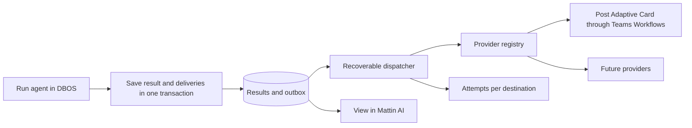

# RFC: Output Providers for Scheduled Tasks

**Status:** implemented; pilot validation with a real Teams Workflows tenant remains pending.  
**Date:** 2026-09-27.  
**First provider:** Teams channels through Workflows and Adaptive Cards.  
**First-iteration scope:** post a card with the result and links to the run details and files in Mattin AI. Native file attachments are deferred to a future extension.

**Second-provider proposal:** [Generic webhooks](rfc-scheduled-task-webhooks.md) designs a webhook destination that can be used alongside Teams, with optional binary attachments configured per webhook and sent through multipart. It documents the changes still required to the current contract, payload preparation, credentials, artifact storage, and recovery; the webhook provider is not implemented.

## 1. Recommendation

Add a result-delivery subsystem independent of agent execution, with destinations reusable within an application and support for multiple destinations per task. Start with `teams_workflow`: a Workflows webhook and an Adaptive Card containing text, metadata, and links. Configure a destination with the workflow URL and its authentication settings; this does not require uploading files to SharePoint or implementing delegated Graph message posting in this iteration. Add email, Slack, and other providers later through adapters implementing the same contract.

A delivery failure must not change the agent run result. Retrying a delivery must not run the task again or incur another LLM charge.

## 2. Fit with the existing code

| Existing component | Proposed change |
|---|---|
| [ScheduledTask/ScheduledTaskRun](../../backend/models/scheduled_task.py) | Already store the application, text, and files for each run. Add bindings and deliveries. |
| [_run_scheduled_task](../../backend/scheduling/periodic_agent_task.py) | Finalizes the run and prunes results. Create deliveries in the run-finalization transaction, before pruning. |
| [ScheduledTaskService](../../backend/services/scheduled_task_service.py) | Validate that destinations belong to the same application and coordinate retention/deletion. |
| [Router](../../backend/routers/internal/scheduled_tasks.py) and [schemas](../../backend/schemas/scheduled_task_schemas.py) | Extend the API with DTOs that contain no secrets and enforce application-scoped permissions. |
| [Form](../../frontend/src/pages/ScheduledTaskFormPage.tsx) and [run details](../../frontend/src/pages/ScheduledTaskRunPage.tsx) | Add destination selection and per-delivery status. |
| [Sandbox factory](../../backend/tools/sandbox/factory.py) | Reuse its name-based registration and allowed-provider pattern in a separate output-provider registry. |

Use the run's `output_text` and `output_files` as the source, not the entire conversation: continuous mode contains multiple runs. Convert `file://` markers into understandable references.

`task_user_context` uses a synthetic identity with no interactive OAuth session. Provider authentication must work unattended and independently of the Mattin AI login, including LOCAL mode.

## 3. Proposed model

| Entity | Responsibility |
|---|---|
| `OutputDestination` | `id`, `app_id`, name, `provider_key`, shared `content_mode` (`result`, `excerpt`, `link_only`), versioned public configuration, write-only provider credentials stored with the destination, enabled flag, and audit data. Reusable across tasks in the same app. Credentials stay in the application database; the MVP adds no vault, secret table, or `secret_ref` indirection. |
| `ScheduledTaskOutputBinding` | Task/destination, enabled flag, and events (`succeeded`, `failed`). One binding per task/destination in the MVP. Content options belong to the channel. |
| `OutputDelivery` | Outbox: run/binding/event, destination and message snapshot, status, attempts, next attempt, lease, expiry, receipt, and sanitized error. |
| `OutputDeliveryAttempt` | Start/end times, outcome, and sanitized diagnostics for each attempt. No tokens or full external response bodies. |

The artifact and upload-checkpoint models described in the [future attachment study](rfc-teams-channel-attachments.md) are outside this initial migration.

`provider_key` is a stable string, not a database enum: adding adapters must not require a migration. Existing tasks start with no bindings. By default, send successful results; failure notifications are optional and contain sanitized messages, without traces.

Pin the destination and content when creating a delivery. Editing a configuration must not silently redirect pending deliveries. Never copy credentials into a delivery payload, workflow argument, attempt record, or log. Resolve them at send time from the destination row. Rotating credentials for the same destination is compatible with pending deliveries; changing a Teams URL creates a new destination revision and requires explicitly cancelling or reassigning pending deliveries.

## 4. Extensible contract

Proposed structure: `backend/output/{contracts,registry}.py`, `backend/output/providers/teams_workflow.py`, destination/delivery services, and the DBOS adapter in `backend/scheduling/output_delivery.py`.

```python
class OutputProvider(Protocol):
    descriptor: ProviderDescriptor
    def validate_config(self, config, secrets) -> ValidatedConfig: ...
    def render(self, envelope: OutputEnvelope, options) -> PreparedMessage: ...
    async def send(self, message, destination, delivery_key: str) -> DeliveryReceipt: ...
```

The neutral envelope contains a version, app/task/run identifiers, name, status, timestamps, text, file references, and a link to the run details. It contains no ORM objects, local paths, or full conversation history. Generate authenticated links to Mattin AI resources, prepare the message deterministically, and persist it before sending. Do not include file bytes or signed download URLs in the message. The receipt distinguishes acceptance from confirmed delivery; errors distinguish permanent rejection, retryable failure, and uncertain outcome.

The descriptor declares public configuration, credential, and option schemas, plus capabilities such as size limits, formats, file links, native attachments, idempotency, and delivery confirmation. `teams_workflow` declares links as supported and native attachments as unsupported. Attachment preparation/upload will be an optional extension for providers that support it; it will not be required by the initial contract. The backend validates options against capabilities, and the UI only displays supported options. Adapters handle provider-specific format, authentication, and responses; the common service handles secrets, concurrency, and attempts. Keep provider-specific conditionals out of the scheduler.

The MVP uses an explicit registry and a deployment-level provider allowlist. Later, packages may register descriptors through entry points under the same contract, rejecting duplicate keys; never load modules supplied by users. Generate simple forms from schemas and allow custom components for complex OAuth flows.

## 5. Delivery flow, recovery, and retention



The delivery table acts as an outbox: create pending deliveries in the same application-database transaction that finalizes the run. A dispatcher recovers pending deliveries even if the immediate DBOS notification is lost. Use a queue separate from `periodic-agents`.

Keep HTTP delivery outside the exception block that marks an agent run as failed. If persistence of the outbox fails, recover the result from the already-completed durable agent step.

Enforce uniqueness on `(run_id, binding_id, event_type)` and use stable workflow IDs. The existing `_run_scheduled_task` creates a run row on each entry, and `orchestrator_run_id` is not unique, so run creation/finalization must first become idempotent: one logical run per scheduled DBOS workflow. Do not notify on intermediate agent retry failures.

### DBOS integration

The current `periodic_task_run(scheduled_time, task_id)` workflow runs on the `periodic-agents` queue, while `invoke_agent_step` is the durable agent step (up to three attempts). `initialize_dbos()` registers that queue and reapplies active schedules after restart. Keep the provider-specific HTTP call out of this workflow: a Teams outage must not replay or change the agent result.

1. After the agent step returns, finalize the `ScheduledTaskRun` and create all eligible `OutputDelivery` outbox rows in one SQLAlchemy transaction. Commit before handing work to DBOS because DBOS system storage and the application database are separate transactions. Use a uniqueness constraint and upsert/read-existing behavior so workflow replay cannot create a second run or duplicate deliveries.
2. After commit, enqueue a delivery workflow on a separately registered `output-deliveries` queue. Its input is only `delivery_id` and a dispatch generation; derive the stable DBOS workflow ID from both (`output-delivery-{delivery_id}-g{generation}`). Do not pass a webhook URL, credential, or secret-bearing configuration because DBOS persists workflow inputs and step history. A known retryable response moves the row to `retry_wait`; when due, the reconciler atomically advances the generation and starts a new workflow.
3. Close the crash window between the SQL commit and DBOS enqueue with a reconciler: at startup and periodically, query eligible `pending` rows and ensure the current dispatch generation has a DBOS workflow. For due `retry_wait`, atomically advance the generation before enqueue. Enqueue is a wake-up optimization; the SQL outbox remains the source of truth. Coordinate multiple reconcilers with atomic claims/leases and uniqueness, and cap queue concurrency globally and per destination.
4. The delivery workflow loads the pinned destination/public-configuration revision and message snapshot, then resolves the latest credential for that destination at execution time and claims one attempt in a short database transaction. Thus rotating a secret takes effect for pending work, while changing the endpoint/channel requires a new destination revision. It performs HTTP without holding the transaction open and persists a sanitized outcome in a separate transaction. Store no credential in `OutputDelivery`, `OutputDeliveryAttempt`, DBOS workflow results, exception text, or logs.
5. Treat the external POST as an at-least-once boundary. The send step must re-check persisted attempt state before issuing HTTP: a recovered workflow that finds an earlier attempt still `sending` marks it `unknown` and exits without posting again. If a worker dies after the receiver accepts the request but before DBOS records the step result or the app records its receipt, recovery cannot prove whether it was posted. Automatic retries apply only to known retryable responses. An operator can explicitly resend an `unknown` delivery with a duplicate warning.

Make each database step idempotent and keep external side effects in a narrowly scoped delivery step. Return known HTTP outcomes as data and persist `retry_wait` rather than raising them into DBOS automatic step retries; the reconciler starts the next generation at the scheduled time. DBOS replays completed durable steps from recorded results, but this does not make a non-idempotent HTTP receiver exactly-once. Persist attempt state before the call and the receipt after it; an interrupted `sending` attempt is conservatively uncertain. Emit a `failed` event only after the parent task workflow reaches its terminal failure policy, never for an intermediate agent-step/workflow recovery attempt. A successful parent agent workflow can therefore finish even when the separate delivery workflow later fails.

Use backoff with jitter, maximum attempts, and an expiry deadline; respect `Retry-After` and limit concurrency per destination/connection. Classify responses by provider. A timeout after sending may produce `unknown`: do not assume every transient error is safe to retry.

Exactly-once external posting cannot be guaranteed: the receiver may accept a message before the process saves its receipt. Do not assume Workflows is idempotent. In the MVP, do not automatically resend `unknown` deliveries; allow a manual resend with a duplicate warning. A managed workflow with key storage and an acknowledgement could improve this guarantee later.

Protect results and files while deliveries are non-terminal, until completion or expiry, with a maximum retention period. Record a Workflows HTTP 2xx as `accepted`, terminal for automatic retries in this iteration. It does not prove that the downstream action posted the card; reserve `delivered` for a future final acknowledgement. Resolve or expire `unknown` outcomes. Links stop working after run retention prunes the results; explain this in the UI. Deleting a task/app cancels pending deliveries and removes snapshots; coordinate in-flight sends. This does not delete messages already posted externally.

## 6. Teams: card with links in the first iteration

Use `teams_workflow`: an administrator configures a workflow that receives the card and posts it to the chosen channel. Mattin AI stores the URL in the destination's write-only credential field and stores the destination's visible labels separately. The workflow fixes the channel; the LLM cannot select URLs or recipients.

The card contains the task name, status, date/time, result or excerpt, a “View result” button, and a list of file links. When the text or file count exceeds the budget, show a bounded excerpt/list and direct users to the run details for the full content. Do not use a second LLM to summarize. Runs with no files still post their result.

Send a JSON envelope with `type: message` and `attachments` of type `application/vnd.microsoft.card.adaptive`; here, attachments are cards, not files. Use links or `Action.OpenUrl` actions. Binaries remain in Mattin AI. The connector documents an approximate 28 KB message-post limit: enforce a lower budget using serialized bytes. [Webhook contract and limits](https://learn.microsoft.com/en-us/connectors/teams/).

### Links to run results and files

Use the canonical base URL and existing run route `/apps/{app_id}/scheduled-tasks/{task_id}/runs/{run_id}`. For each file, propose a stable frontend route `/apps/{app_id}/scheduled-tasks/{task_id}/runs/{run_id}/files/{file_id}`. It opens a protected page, checks access to the run, and resolves the download through the authenticated API. This file route is new and must be implemented; do not assume it already exists.

If the recipient has no session, send them to login and preserve a validated internal return path. A link does not grant access: the recipient needs permission to the app, task, and file. Channel members without Mattin AI permissions will see an access-denied page. Confirm this experience during destination setup and test it in browsers and the Teams client.

Do not include `/static` links signed with the creator's email or any credentials in the card. Resolve a download URL only after authenticating the user who opens the link. Do not reuse `file://` markers as URLs; map them only to IDs present in `run.output_files`.

Link availability follows run/file retention. If the item has been deleted, show “Result or file is no longer available” without serving content from another run. For continuous conversations, verify the previously identified risk of files being overwritten by name in current storage: preserve identity/version per run, for example by storing physical files by file_id. Relaxing native attachments does not allow linking to the wrong file version. No SharePoint transfer spool is needed in this iteration.

### Workflow authentication and operation

The trigger supports `Anyone` by URL and access restricted to tenant/users. Make the selected mode explicit in configuration; in `Anyone` mode, do not send a Bearer token and protect the URL as a credential. If the deployment requires Entra authentication, obtain a token for Power Automate and validate identity/claims in the pilot tenant; do not substitute a Graph token or the Mattin AI user's session. [Teams trigger](https://learn.microsoft.com/en-us/connectors/teams/#when-a-teams-webhook-request-is-received), [HTTP trigger authentication](https://learn.microsoft.com/en-us/power-automate/oauth-authentication).

Workflows connections depend on specific owners. Assign co-owners and define connection maintenance. [Workflow ownership](https://learn.microsoft.com/en-us/microsoftteams/platform/webhooks-and-connectors/what-are-webhooks-and-connectors).

Present HTTP 2xx as “Accepted by Teams Workflows,” not “Posted” or “Delivered.” Destination testing posts a clearly identified card with links and asks the user to visually confirm it in the channel. Automatic final acknowledgement is a future extension. Validate availability, tenant policies, and required channel types; do not use legacy Office 365 connectors. [Connector retirement](https://devblogs.microsoft.com/microsoft365dev/retirement-of-office-365-connectors-within-microsoft-teams/).

### Future extension

The [native attachment study](rfc-teams-channel-attachments.md) remains a future reference. SharePoint uploads, resumable sessions, Graph write credentials and delegated posting, artifact/checkpoint models, and per-file states are outside the current scope. Declared capabilities preserve a path to add that mode without changing the scheduler or common delivery rules.

## 7. API, UI, and permissions

Proposed routes under `/internal/apps/{app_id}`:

- `GET /output-providers`: allowed provider catalog and capabilities.
- CRUD `/output-destinations` and `POST /output-destinations/{id}/test`.
- `GET/PUT /scheduled-tasks/{task_id}/outputs`: list/replace bindings transactionally.
- `GET /scheduled-tasks/{task_id}/runs/{run_id}/deliveries`.
- `POST /scheduled-tasks/{task_id}/runs/{run_id}/deliveries/{delivery_id}/retry`.

App settings: “Output destinations,” write-only credentials (save/rotate/clear; never read back), and test. Task form: “Send results,” multiple destinations/events/content options. Run details: per-destination delivery states and attempts, separate from agent status. Destination settings: name, secret URL, authentication mode, enabled, and “Test card and links.” Microsoft 365 delegated-Graph login is not part of the initial path.

Admins manage destinations and their write-only credentials; editors bind enabled destinations from their app and retry; viewers see sanitized statuses. Enforce permissions in services and cross-reference checks. Audit assignments and external posts.

Do not create a separate vault/table or secret-reference subsystem for the MVP. Store the Teams workflow URL in the destination's write-only credential field in the same app-scoped database record, following the existing per-app service credential/API masking and export-sanitization conventions. The current `BaseService.api_key` is a text column and `secret_utils` masks values at API boundaries; neither provides application-level encryption at rest. Treat database access, backups, and transport security accordingly. If application-level encryption at rest is required, add it as a shared credential-storage improvement across existing service credentials and output destinations, rather than a Teams-only store. Keep full webhook URLs and tokens out of public DTOs, logs, errors, DBOS inputs/outputs, and exports; authenticated result links are intentionally part of the published content. Use HTTPS and provider-specific host policies, block internal networks and unauthorized redirects, and apply the same restrictions to tests.

The marketplace does not expose destinations/secrets/attempts. Future exports or copies include only public configuration, no files or remote delivery references, and disabled bindings until credentials are configured; never inherit destinations across apps automatically.

## 8. Rollout and validation

1. Contract/registry, models/migration, app-scoped write-only credentials in the destination record, CRUD, permissions, and bindings.
2. Transactional finalization/outbox, run deduplication, recoverable dispatcher, attempts, and retention.
3. First Teams iteration: webhook/Adaptive Card, authenticated links to run details and files, size budget, setup/test flow, and UI with `accepted` status.
4. Add a second adapter; later add native attachments, final acknowledgements, a bot, or other authentication modes as needed.

For this iteration, check links with and without a session, login return path, denied access, files removed by retention, and the correct file version in continuous mode. Upload/native-attachment criteria from the future study are not current acceptance requirements.

Implementation tests: provider contract with a fake provider; preserve agent results on delivery failure; recovery after commit; two competing workers; run replay; 429/Retry-After; ambiguous timeout; destination change/rotation; retention; app isolation; no secrets in output; Unicode/JSON/file markers; payload size; real post and downstream workflow failure.

MVP acceptance: a visible card with result and valid links to run details and files; downloads work for authorized Mattin AI users; two channels per task; failures are independent per destination; retry does not rerun the agent; restart recovers pending deliveries; existing tasks with no outputs keep working; acceptance is distinct from confirmed posting; expiry prevents indefinite retention.

Technical feasibility is high because results are persisted and DBOS is already present. The main effort is reliability, permissions, operations, and the HTTP adapter. Before implementation, validate the Workflows template, authentication mode, tenant policies/licensing, channel types, and Mattin AI access from links in the pilot tenant. This analysis has not sent messages or tested real credentials.
