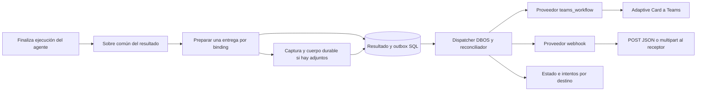

# RFC: Webhook como destino adicional de notificación

**Estado:** implementado.  
**Fecha:** 2026-10-06.  
**Ámbito:** resultados de tareas programadas de Mattin AI.  
**Complementa:** [Output Providers](rfc-scheduled-task-output-providers.md).  
**Decisión propuesta:** incorporar `webhook` como segundo proveedor del subsistema de entregas, compatible con `teams_workflow` y seleccionable junto a él en una misma tarea.

## 1. Comportamiento esperado y alcance

Una tarea puede notificar su resultado a un canal de Teams, a uno o varios endpoints HTTPS, o a ambos. Cada destino recibe una entrega independiente: si el webhook falla y Teams acepta su tarjeta, se conserva ese resultado y solo se reintenta la entrega pendiente. Ninguna incidencia de notificación modifica el resultado del agente ni vuelve a ejecutarlo.

El webhook es **saliente**: Mattin AI realiza un `POST` a un servicio del cliente. Envía JSON cuando no se adjuntan archivos y `multipart/form-data` con el evento JSON y los archivos cuando el destino tiene activada esa opción. Aunque Teams también utiliza un webhook de Workflows como transporte, el nuevo proveedor ofrece un contrato genérico para sistemas externos, sin exigir una Adaptive Card ni una conexión Microsoft 365.

La primera iteración incluye notificaciones de ejecuciones satisfactorias, los modos actuales `result`, `excerpt` y `link_only`, **envío opcional de los archivos completos configurado por webhook**, autenticación de servicio, firma opcional, prueba del destino y seguimiento de intentos. Se conservan los enlaces autenticados a resultados y archivos. `include_attachments` es `false` por defecto.

No se incorporan en esta iteración plantillas arbitrarias, métodos HTTP configurables, cabeceras libres, OAuth, adjuntos codificados en base64, callbacks de confirmación, endpoints privados ni notificaciones de conversaciones interactivas. `task.run.failed` queda reservado para una extensión: actualmente los bindings y la creación de entregas fijan `succeeded`; su incorporación requiere emitirlo exclusivamente ante un fallo terminal y sanear el diagnóstico.

## 2. Encaje con la implementación actual

La base ya permite destinos reutilizables por aplicación, bindings por tarea, outbox SQL, cola DBOS independiente, reconciliación, leases e intentos. La separación de ejecución y entrega debe conservarse.

| Componente actual | Observación | Cambio diseñado |
|---|---|---|
| [contracts.py](../../backend/output/contracts.py) | El contrato solo valida un secreto y envía un diccionario. | Añadir validación de configuración/credenciales, preparación del mensaje y contexto de envío. |
| [registry.py](../../backend/output/registry.py) | Registra únicamente `teams_workflow`. | Registrar `WebhookProvider` con clave estable `webhook`. |
| [_run_payload y test_destination](../../backend/output/service.py) | Construyen siempre una Adaptive Card, también al probar destinos. | Construir un sobre común y delegar su formato al proveedor. |
| [OutputDestination](../../backend/models/output_delivery.py) | Guarda `public_config` y una URL secreta; no dispone de token o clave de firma separados. | Conservar `webhook_url` y añadir `credentials` JSON nullable, de escritura exclusiva en la API. |
| [OutputDelivery](../../backend/models/output_delivery.py) | Persiste el cuerpo JSON de Teams. | Conservar `payload`; añadir `request_body` para JSON y `request_body_path`, tamaño y SHA-256 para el cuerpo multipart en almacenamiento durable. |
| [Gestión de archivos](../../backend/services/file_management_service.py) y [limpieza](../../backend/services/file_cleanup_worker.py) | Los archivos de sesión pueden caducar o cambiar entre ejecuciones. | Añadir capturas inmutables `OutputArtifact` y protegerlas, junto con el cuerpo multipart, hasta finalizar o vencer las entregas. |
| [Schemas](../../backend/schemas/output_provider_schemas.py) | La creación restringe `provider_key` a `teams_workflow`. | Admitir `webhook` y validar opciones mediante el registro. |
| [Router](../../backend/routers/internal/output_providers.py) | Ya expone destinos, pruebas, bindings y reintentos. | Extender los DTOs y usar preparación/prueba por proveedor. |
| [Dispatcher](../../backend/scheduling/output_delivery.py) | Despacha por ID y generación y recupera trabajo pendiente. | Reutilizarlo; mantener HTTP y secretos fuera de los argumentos DBOS. |
| [Formulario](../../frontend/src/pages/ScheduledTaskFormPage.tsx) | La creación fija `teams_workflow` y los mensajes hablan de canales. | Selector de tipo y campos específicos; selección conjunta de destinos. |
| [Panel de entregas](../../frontend/src/components/scheduled-tasks/OutputDeliveriesPanel.tsx) | Muestra estado e intentos. | Mostrar proveedor y mensajes independientes de Teams. |

El cambio principal es separar el **resultado común** del **formato de transporte**. No basta con registrar otro adaptador: hoy recibiría la misma tarjeta que Teams. Tampoco debe eliminarse la restricción de hosts de Microsoft para reutilizar su validador con URLs genéricas; cada proveedor conserva su política.

## 3. Arquitectura y preparación del mensaje



Contrato conceptual propuesto, con tipos concretos al implementarlo:

```python
class OutputProvider(Protocol):
    descriptor: ProviderDescriptor

    def validate_destination(self, config, credentials) -> None: ...
    def prepare(self, envelope, options) -> PreparedMessage: ...
    async def send(self, destination, message, context) -> DeliveryReceipt: ...
```

`OutputEnvelope` contiene identificadores, nombre, estado, fechas UTC, texto saneado, referencias de los archivos de esa ejecución y URL del resultado. No recibe el historial de conversación, objetos ORM, rutas locales ni credenciales. El saneamiento existente de `file://` se mueve a la construcción común. Cada proveedor aplica sus propios presupuestos de contenido: Teams conserva sus límites y su tarjeta; webhook prepara JSON estructurado y, si corresponde, incorpora handles autorizados de las capturas de archivos al preparar el multipart.

`PreparedMessage` contiene formato/versionado, tipo de contenido exacto y cuerpo definitivo, como bytes para JSON o como referencia a un objeto durable para multipart. Se persiste antes de enviar. `request_body` conserva los bytes UTF-8 del JSON; `request_body_path`, `request_body_size` y `request_body_sha256` conservan la clave privada de almacenamiento, tamaño y SHA-256 del multipart; `OutputArtifact` registra las capturas vinculadas. `payload` mantiene el evento JSON legible, sin bytes de archivos ni rutas de almacenamiento. El transporte envía el cuerpo persistido mediante `content=` o un stream, sin volver a serializarlo con `json=` o reconstruirlo con `files=` en cada intento.

El multipart se prepara una sola vez con boundary, orden de partes y cabeceras fijados; se guarda junto con su `Content-Type` exacto y longitud. Una actualización del renderizador, del serializador o de la biblioteca multipart no cambia el cuerpo entre intentos. Los binarios se almacenan fuera de la base de datos en un spool durable accesible por todos los workers, y se leen por streaming.

El descriptor declara `supports_binary_attachments=true` para webhook y `false` para Teams; es una capacidad distinta de los adjuntos nativos de mensajes Teams. El contexto proporciona el ID del evento, número de intento, política de reintentos y opción de adjuntos fijados al crear la entrega. Las credenciales actuales se resuelven dentro del proceso de envío; no se incorporan al mensaje, al contexto persistido en DBOS ni al recibo. `DeliveryError` y utilidades de diagnóstico dejan de depender del módulo de Teams y pasan a un módulo común; la clasificación HTTP sigue siendo propia de cada adaptador.

La finalización persiste el resultado y una fila por binding en la misma transacción. Un error de preparación específico de un destino crea una entrega `failed` con diagnóstico saneado, sin impedir la creación de las otras entregas ni marcar como fallida la ejecución del agente. Si falla la transacción SQL, se utiliza la recuperación durable existente del resultado para reintentar su persistencia.

## 4. Configuración, credenciales y API

Los destinos siguen perteneciendo a una aplicación. Un administrador configura un destino; un editor lo asigna a tareas y reintenta entregas; un lector consulta estados saneados. Se mantienen las comprobaciones de pertenencia de aplicación, tarea, ejecución y entrega en cada operación.

Ejemplo ilustrativo de creación, con valores de documentación:

```http
POST /internal/apps/12/output-destinations
Content-Type: application/json
```

```json
{
  "name": "Integración de informes",
  "provider_key": "webhook",
  "webhook_url": "https://hooks.example.com/mattin/results",
  "public_config": {
    "schema_version": "1",
    "auth_mode": "hmac_sha256",
    "receiver_deduplicates": false,
    "include_attachments": true
  },
  "credentials": {
    "signing_secret": "<clave-aleatoria-de-32-bytes-en-base64>"
  }
}
```

`public_config` admite únicamente los campos declarados. `schema_version` solo acepta `1` inicialmente. `receiver_deduplicates` es un compromiso configurado por el administrador tras validar el receptor; no se infiere de una respuesta HTTP ni de la presencia de una cabecera.

**`include_attachments` es un booleano del destino webhook**, con valor por defecto `false` cuando se omite. En `false` se envía el evento JSON con referencias/enlaces según el modo de contenido; en `true` se envía el evento y todos los archivos de la ejecución en una única llamada multipart. Se aplica a todas las tareas que usan ese destino; no existe una opción de adjuntos en el binding. Se pueden crear dos destinos al mismo endpoint si se necesitan políticas distintas por tarea.

El administrador puede editar `include_attachments` mediante el PATCH del destino. El cambio se aplica a futuras entregas; cada entrega fija el valor en `destination_snapshot` al crearse y conserva su formato, archivos y contenido al reintentarse. Cambiarlo no convierte una entrega pendiente de JSON a multipart ni a la inversa. El API devuelve este campo público y no admite valores no booleanos. `teams_workflow` no admite esta opción.

| `auth_mode` | Credencial | Comportamiento |
|---|---|---|
| `hmac_sha256` — valor recomendado por defecto | `signing_secret` | Firma el cuerpo y datos de correlación; el receptor verifica origen e integridad. |
| `bearer` | `bearer_token` | Envía `Authorization: Bearer …`; no incluye firma. |
| `none` | Ninguna adicional | Solo HTTPS, seleccionada expresamente; puede utilizar un endpoint cuya propia URL sea secreta. |

La clave HMAC representa 32 bytes aleatorios codificados en base64; el backend valida el formato y longitud decodificada. El token Bearer y la URL se validan en longitud y se rechazan caracteres de control. No se aceptan credenciales incompatibles con el modo elegido. No hay cabeceras configurables por el usuario.

`webhook_url`, `bearer_token` y `signing_secret` nunca se devuelven desde GET/listados ni se incorporan a exports, copias, marketplace, intentos o logs. El DTO devuelve configuración pública y presencia de URL/credenciales, conservando `has_secret` para compatibilidad. El formulario vacía los inputs sensibles tras guardar.

Las credenciales se guardan con el destino, siguiendo el almacenamiento actual. Una columna JSON no cifra secretos: se mantiene la protección de base de datos, transporte y backups del sistema existente. Si se exige cifrado de aplicación, se trata como una mejora común de credenciales, no como un almacén exclusivo del webhook.

No cambia el conjunto de rutas: catálogo de proveedores, CRUD de destinos, prueba, bindings de tarea y consulta/reintento de entregas. Los schemas de creación/edición añaden `public_config` y `credentials`. Una edición parcial conserva secretos omitidos; para borrar o sustituirlos, el request expresa la operación y debe dejar el destino válido. Las peticiones antiguas sin estos campos siguen creando destinos Teams.

La URL, proveedor, modo de autenticación, versión del contrato y política de deduplicación son inmutables para este MVP. Para cambiarlos se crea otro destino y se cambia la asignación para futuras ejecuciones; las entregas existentes no se redirigen. La rotación de token/clave sí afecta a las pendientes del mismo destino. En Teams se conserva su regla actual de rotación de URL; en webhook se considera toda la URL identidad del endpoint, incluida la query, y su cambio exige otro destino. Eliminar/deshabilitar un destino impide nuevos envíos y cancela/finaliza pendientes con diagnóstico, coordinando los intentos en curso.

## 5. Contrato del webhook y adjuntos opcionales

Se publica el contrato **Mattin webhook v1**, propio del producto. El endpoint debe aceptar `POST` con `Content-Type: application/json` cuando `include_attachments=false`, o `multipart/form-data; boundary=…` cuando es `true`. El evento JSON mantiene el mismo esquema en ambos casos. Este ejemplo muestra una entrega en modo `result` sin bytes adjuntos:

```json
{
  "schema_version": "1",
  "event_id": "d6eb7aab-783a-4fa1-a51b-96ec8d6c89de",
  "event_type": "task.run.succeeded",
  "occurred_at": "2026-10-06T08:01:12Z",
  "app": { "id": 12 },
  "task": { "id": 41, "name": "Informe diario" },
  "run": {
    "id": 987,
    "status": "succeeded",
    "scheduled_at": "2026-10-06T08:00:00Z",
    "completed_at": "2026-10-06T08:01:12Z"
  },
  "content": {
    "mode": "result",
    "text": "Informe generado: informe.xlsx",
    "text_truncated": false,
    "files_truncated": false,
    "files": [
      {
        "file_id": "file-example-123",
        "filename": "informe.xlsx",
        "url": "https://mattin.example.com/apps/12/scheduled-tasks/41/runs/987/files/file-example-123"
      }
    ]
  },
  "attachments": [],
  "links": {
    "result": "https://mattin.example.com/apps/12/scheduled-tasks/41/runs/987"
  }
}
```

`event_id` es un UUID generado una vez por entrega, persistido en `payload` antes del primer envío y reutilizado en todos sus reintentos, también manuales. La unicidad SQL existente `(run_id, binding_id, event_type)` evita generar otro evento al recuperar la misma ejecución. Dos destinos tienen eventos diferentes, aunque referencien el mismo run. No se exige una columna adicional para el UUID.

`occurred_at` y `completed_at` se obtienen de `run.finished_at`, no del momento de cada intento; `scheduled_at` se obtiene de `run.scheduled_time`. Las fechas se normalizan a UTC y terminan en `Z`. No se presupone orden de llegada entre ejecuciones ni destinos. Nuevos campos opcionales pueden añadirse en v1; renombrados o cambios semánticos exigen otra versión. El receptor debe ignorar campos adicionales.

Presupuestos iniciales propuestos del producto para el **evento JSON**, tanto independiente como dentro del multipart: máximo de **256 KiB**, hasta **100.000 caracteres** de texto en `result`, **4.000** en `excerpt` y **50 referencias** de archivos. Se mide también el tamaño total después de serializar a UTF-8. Al exceder el presupuesto se recortan texto/lista de enlaces de forma determinista y se activan los indicadores correspondientes; nunca se corta el JSON serializado. Si los campos obligatorios o el manifiesto completo de adjuntos por sí solos no caben, falla la preparación de esa entrega. El truncamiento de referencias no elimina archivos adjuntos.

`link_only` envía metadatos y `links.result`, con `content.text = null`, `content.files = []` e indicadores de truncamiento falsos: la omisión es deliberada por el modo. Los otros modos incluyen referencias de los archivos de `run.output_files`. **La opción de adjuntos es independiente del modo de texto:** `link_only` con `include_attachments=true` envía también los archivos completos y su manifiesto en `attachments`. No se añaden archivos de otras ejecuciones de una conversación continua.

Los enlaces apuntan a las rutas protegidas actuales: no conceden permisos al receptor ni permiten a un servicio externo descargar automáticamente los archivos. Las credenciales de webhook autentican Mattin AI frente al receptor; no autentican al receptor frente a Mattin AI. No se envían URLs de descarga firmadas ni cookies. Con adjuntos habilitados, el receptor recibe los bytes directamente y no necesita una sesión de Mattin AI para leerlos. La disponibilidad de enlaces sigue la retención de la ejecución; el texto y archivos que el receptor almacene tienen su propia retención.

### 5.1. Formato de la llamada con adjuntos

Se usa `multipart/form-data` conforme a [RFC 7578](https://www.rfc-editor.org/rfc/rfc7578.html), con una primera parte `payload` de tipo `application/json` que contiene el evento completo, seguida de una parte binaria por archivo. Los nombres de parte son únicos y estables (`file_1`, `file_2`, …); se ordenan por `file_id` al preparar la entrega. Cada entrada de `attachments` vincula el archivo con su parte:

```json
{
  "attachments": [
    {
      "file_id": "file-example-123",
      "filename": "informe.xlsx",
      "content_type": "application/vnd.openxmlformats-officedocument.spreadsheetml.sheet",
      "size_bytes": 12345,
      "sha256": "aaaaaaaaaaaaaaaaaaaaaaaaaaaaaaaaaaaaaaaaaaaaaaaaaaaaaaaaaaaaaaaa",
      "part_name": "file_1"
    }
  ]
}
```

El ejemplo anterior es un fragmento del evento; el hash es ilustrativo y se calcula sobre los bytes reales. Esquema de transporte, con saltos CRLF y bytes indicados mediante marcadores:

```http
POST /mattin/results HTTP/1.1
Content-Type: multipart/form-data; boundary=mattin-example-boundary

--mattin-example-boundary
Content-Disposition: form-data; name="payload"
Content-Type: application/json

<evento JSON completo con attachments>
--mattin-example-boundary
Content-Disposition: form-data; name="file_1"; filename="file_1.xlsx"
Content-Type: application/vnd.openxmlformats-officedocument.spreadsheetml.sheet

<bytes originales del XLSX>
--mattin-example-boundary--
```

El nombre original, incluidos caracteres Unicode, se conserva en el JSON. El `filename` de transporte es ASCII seguro, derivado de la parte y una extensión validada; no contiene rutas ni caracteres de control. El nombre no es la identidad del archivo: dos archivos con el mismo nombre tienen `file_id` y partes diferentes. Si no se puede determinar un MIME válido, se usa `application/octet-stream`. No se aplica base64 ni `Content-Transfer-Encoding` a los binarios.

El boundary se genera una sola vez, se comprueba que no colisione con ninguna parte y se persiste con el cuerpo. Con `include_attachments=true` y una ejecución sin archivos, la llamada sigue siendo multipart con solo `payload` y `attachments=[]`; la falta de archivos no produce un error ni cambia el formato contratado con el receptor.

### 5.2. Límites y política de integridad

Límites iniciales implementados para el modo con adjuntos: **10 archivos**, **10 MiB por archivo**, **25 MiB de bytes de archivos en total** y **26 MiB para la llamada multipart completa**, incluyendo evento y cabeceras. Se fijan para la entrega al crearla y se muestran al configurar/probar el webhook.

Activar la opción implica enviar **todos los archivos de esa ejecución**. Si falta uno, excede los límites, no pertenece al run o no puede leerse/capturarse, la entrega webhook queda `failed` con diagnóstico saneado antes de realizar HTTP. No se truncan bytes, omiten archivos, sustituyen por enlaces ni dividen en varias llamadas. Las entregas a Teams y a otros destinos siguen su propio resultado. El tamaño se comprueba leyendo los bytes, no solo confiando en metadatos.

El receptor valida que cada parte declarada aparece exactamente una vez, que no existen partes extra y que tamaños y SHA-256 coinciden. El 2xx implica aceptación durable del evento **y de todos sus adjuntos**. Si el receptor rechaza por tamaño (413) o por contrato (415/422), la entrega falla sin reintento automático; corregir la configuración no transforma el cuerpo de una entrega existente.

### 5.3. Captura durable y conservación para reintentos

Para cada ejecución con al menos un destino que requiera adjuntos se capturan únicamente los archivos de `run.output_files`. Se añade `OutputArtifact`, único por `(run_id, file_id)`, con nombre, MIME, tamaño, SHA-256 y clave privada de almacenamiento. Las capturas son inmutables, compartidas entre los destinos de esa ejecución y accesibles por todos los workers. Se comprueba pertenencia a app/tarea/conversación, rutas y symlinks mediante el servicio de archivos; el adaptador recibe handles autorizados, no rutas elegidas por el LLM ni URLs que deba descargar.

La captura debe ocurrir antes de que otra ejecución pueda sobrescribir los archivos de origen: preferentemente en el paso durable que produce los archivos, asociado al ID lógico de ejecución, o con versionado/bloqueo que cubra a todos los escritores. Copiar tarde durante el envío no garantiza la versión correcta en conversaciones continuas. La recuperación reutiliza el manifiesto ya capturado y no vuelve a ejecutar el agente.

El almacenamiento y SQL no comparten una transacción: escribir capturas y multipart en ubicaciones temporales, finalizar de forma atómica y después confirmar manifiestos/outbox que referencian objetos completos. El flujo se identifica de forma estable para recuperar capturas tras una caída; la limpieza reconcilia objetos huérfanos sin borrar preparaciones aún en curso. Los errores de captura/preparación se aíslan por destino.

El spool conserva los bytes completos de cada multipart y su hash, aunque el archivo original desaparezca o cambie. Antes de enviar se verifica la existencia, longitud e integridad del objeto; ante pérdida/corrupción se falla sin reconstruir un cuerpo diferente ni enviar parcialmente. Se transfieren bytes por streaming, sin cargar todos los adjuntos en memoria.

El run, capturas y cuerpos multipart se protegen frente a la poda y al worker de limpieza mientras haya entregas `pending`, `sending`, `retry_wait` o `unknown` vigentes que los necesiten. También se protege una entrega `failed` y su cuerpo hasta `expires_at` si admite reintento manual; después se rechaza el reintento. La limpieza libera las capturas/cuerpos cuando todas las entregas asociadas han sido aceptadas, canceladas o han vencido, sin reintentos vigentes ni lecturas activas. Deshabilitar una tarea/destino cancela el trabajo pendiente, coordinando streams en curso. Borrar la app/tarea inicia la retirada local después de cerrar los envíos activos; no borra las copias ya aceptadas por el receptor.

## 6. Identificación, firma y obligaciones del receptor

Cabeceras comunes, con `Content-Type` elegido según la opción de adjuntos:

```http
Content-Type: application/json
X-Mattin-Event-Id: d6eb7aab-783a-4fa1-a51b-96ec8d6c89de
X-Mattin-Event-Type: task.run.succeeded
X-Mattin-Attempt: 1
Idempotency-Key: d6eb7aab-783a-4fa1-a51b-96ec8d6c89de
```

La clave de idempotencia es una convención de este contrato; enviar la cabecera no garantiza deduplicación. Con HMAC se añaden `X-Mattin-Timestamp` (segundos Unix del intento) y `X-Mattin-Signature: v1=<digest_hex>`. La firma cubre el tipo de contenido y el cuerpo HTTP completo, incluyendo todas las partes y binarios cuando es multipart. Se calcula exactamente sobre:

```text
signed_bytes = ASCII(event_id + "." + timestamp + "." + content_type + ".") + body_bytes
digest_hex = HMAC_SHA256(BASE64_DECODE(signing_secret), signed_bytes).hexdigest()
```

`content_type` es el valor ASCII exacto de la cabecera enviada y persistida, incluido el boundary en multipart; `body_bytes` son los bytes del cuerpo persistido, sin el framing de transferencia HTTP. HMAC se calcula incrementalmente sobre el prefijo y el stream del spool, sin concatenar los adjuntos en memoria. El receptor usa el mismo valor de cabecera y cuerpo original antes de parsear JSON/multipart, con comparación de tiempo constante. No se usa solo la parte `payload` ni se reconstruye el multipart para verificar la firma.

El receptor comprueba que el ID y tipo de evento de las cabeceras coinciden con el evento JSON y que el timestamp está dentro de una tolerancia propuesta de cinco minutos, también para fechas futuras. El cuerpo, boundary y tipo de contenido no cambian entre reintentos; timestamp, firma y número de intento sí. Se requiere reloj sincronizado. El contrato no se presenta como una implementación de otro estándar de firmas.

Tras verificar la autenticación, el receptor valida la versión y los adjuntos, registra el evento y sus archivos de forma durable y responde con `200`, `202` o `204`. Puede procesarlos después; un 2xx expresa aceptación por el receptor y se registra como `accepted`, sin prometer la finalización del proceso externo. El recibo conserva solo datos controlados por Mattin AI: código HTTP, ID de evento y momento de aceptación; no guarda el cuerpo de respuesta.

Si declara `receiver_deduplicates=true`, debe almacenar el `event_id`, tipo de contenido y hash del cuerpo de manera atómica con la aceptación/encolado del evento y todos sus archivos o con el efecto de negocio. Un duplicado idéntico devuelve 2xx sin repetir el efecto ni crear nuevas copias de los adjuntos; el mismo ID con otro contenido se rechaza y se investiga. La deduplicación debe sobrevivir a reinicios y cubrir concurrencia, no solo una caché en memoria. Si el procesado es asíncrono, su propio worker mantiene esa garantía.

La ventana de deduplicación cubre la vigencia de entrega más el margen de reloj. El MVP no permite reintentar después de `expires_at`; la API de reintento debe aplicar esa comprobación. Una repetición fuera de esa ventana sería una nueva entrega explícita en una extensión posterior. Durante la rotación HMAC, el receptor puede aceptar temporalmente ambas claves por la duración máxima de un intento en curso; los próximos intentos utilizan la nueva.

## 7. Seguridad del destino

Se permiten endpoints HTTPS en puerto 443 con certificado verificado, sin userinfo ni fragmento, sin exigir una allowlist de nombres de host por despliegue. Para reducir riesgo SSRF, el host debe resolver a IPs globales; se rechazan resoluciones privadas, reservadas, loopback y link-local. No se siguen redirecciones.

Se rechazan las resoluciones DNS que contienen direcciones no globales, incluyendo loopback, redes privadas, link-local y metadatos cloud. La validación DNS se repite en cada intento. Como el cliente HTTP vuelve a resolver el nombre al conectar, el despliegue también debe aplicar controles de egreso para mitigar cambios DNS entre validación y conexión. Esta política sigue las recomendaciones sobre SSRF, DNS y redirecciones de [OWASP SSRF Prevention](https://cheatsheetseries.owasp.org/cheatsheets/Server_Side_Request_Forgery_Prevention_Cheat_Sheet.html).

La prueba utiliza el mismo cliente y política que el envío normal. El transporte se configura explícitamente, sin proxies heredados del entorno; un proxy gestionado requiere configuración deliberada. Un cambio de DNS hacia una dirección no pública puede bloquear una entrega pendiente con diagnóstico saneado.

Los logs HTTP y de trazas deben ocultar URL completa, query y cabeceras sensibles; los errores no interpolan excepciones de librería ni respuestas externas. Se usa lectura en streaming acotada a 8 KiB y se deshabilitan reintentos automáticos del cliente. La clasificación utiliza el código de las cabeceras: un 2xx recibido no pasa a `unknown` porque la lectura de un cuerpo opcional falle o exceda el presupuesto. Las URLs de resultados usan la base canónica de Mattin AI, nunca una URL elegida por el LLM. Los endpoints internos requerirían una política administrada específica en una extensión.

## 8. Estados, reintentos y recuperación

Se conservan `pending`, `sending`, `retry_wait`, `accepted`, `failed` y `unknown`. No se introduce `delivered` sin un protocolo de confirmación final.

| Resultado del intento | Sin deduplicación del receptor | Con deduplicación validada |
|---|---|---|
| 2xx | `accepted`, terminal. | Igual. |
| Fallo de conexión antes de enviar bytes | `retry_wait`. | Igual. |
| 429 | `retry_wait`, según el contrato de rechazo sin procesamiento. | Igual. |
| 408, 5xx, timeout de lectura/escritura o corte después de enviar | `unknown`, sin reintento automático. | `retry_wait` con el mismo evento/cuerpo. |
| Worker interrumpido con intento `sending` y lease vencido | `unknown`, sin reenviar. | Recuperar como `retry_wait`, manteniendo el mismo evento/cuerpo. |
| 3xx, otros 4xx, URL no permitida o credencial/configuración inválida | `failed`, diagnóstico saneado. | Igual. |

El contrato del receptor exige que 429 indique rechazo antes de registrar/procesar el evento. No se interpreta 409 como éxito; un receptor con deduplicación debe responder 2xx ante duplicados válidos. El modo conservador es el valor por defecto. Los POST no son automáticamente idempotentes y `Retry-After` no demuestra que un evento no se haya procesado: esta separación sigue [RFC 9110, idempotencia](https://www.rfc-editor.org/rfc/rfc9110.html#section-9.2.2).

Se mantiene el máximo actual de cinco intentos, backoff con jitter y vencimiento vigente de la entrega. Se respeta `Retry-After` válido en segundos o fecha HTTP; si solicita una espera que supera el vencimiento, no se acorta para enviar antes y se finaliza como expirado. Este tratamiento de la cabecera corresponde a [RFC 9110, Retry-After](https://www.rfc-editor.org/rfc/rfc9110.html#section-10.2.3). Estos presupuestos son límites del producto, no garantías del receptor.

Para JSON se propone un límite total de 20 segundos por intento y el lease actual de 120 segundos. Para multipart, el límite total propuesto es de 120 segundos y el lease de 180 segundos, con conexión hasta cinco segundos en ambos casos y respuesta acotada. El timeout de escritura y el plazo total cubren la transferencia de archivos; un timeout por operación no sustituye el plazo total. El servicio y el reconciliador deben usar la duración de lease del formato fijado en la entrega. La cola mantiene un límite global; añadir un límite compartido por destino entre workers evita que varias tareas saturen el mismo endpoint. No se mantiene una transacción SQL abierta durante HTTP.

El reconciliador conserva la fuente de verdad SQL y los IDs DBOS por entrega/generación. La recuperación de `sending` tiene que aplicar la política fijada en `destination_snapshot`, tanto en `process_delivery` como en el reconciliador; no basta con adaptar la clasificación de respuestas del nuevo proveedor. Teams mantiene siempre la recuperación conservadora vigente.

El reintento manual conserva el mismo cuerpo y evento, no regenera el resultado. En multipart se reenvía la llamada completa con todos sus adjuntos; no se reanuda una carga parcial ni se continúa archivo por archivo. Ante `unknown` sin deduplicación, la UI exige confirmar el posible duplicado, también de los archivos. La protección de resultados/archivos y el vencimiento se amplían al spool durable según la sección 5.3. Deshabilitación, borrado o cancelación no pueden deshacer un POST ya aceptado por el receptor.

## 9. API y experiencia de usuario

La sección **App Settings → Output Channels** registra y administra los destinos Teams y webhook de la aplicación, incluidas credenciales, prueba, modo de contenido y configuración de adjuntos. La tarea programada solo selecciona los destinos registrados; no configura el contenido ni administra endpoints. `include_attachments` se configura en el webhook y queda desactivado por defecto. La deduplicación se acompaña de la obligación concreta del receptor, no de una promesa de envío exactamente una vez.

La pantalla utiliza el patrón de AI Services: tabla de canales, botón de alta y menú de acciones por fila (probar, editar y eliminar). La creación y la edición se realizan en un modal wizard con tres pasos: canal, configuración y revisión. Los cambios se guardan al confirmar el último paso. En edición no se muestran las credenciales guardadas: los campos opcionales vacíos conservan la URL de Teams o la credencial del webhook; seleccionar autenticación sin credenciales elimina las anteriores. El tipo de canal y el endpoint del webhook se conservan; para cambiarlos se registra otro canal.

El canal define `content_mode` (`result`, `excerpt` o `link_only`) como propiedad común a Teams y webhook, independiente de `public_config`. El selector está en el paso Configuración del wizard y se aplica a todas las tareas vinculadas. Los límites son 5.000/1.200 caracteres en Teams y 100.000/4.000 en webhook para resultado/extracto. Cambiar el canal afecta a las futuras entregas; las ya preparadas conservan su payload y snapshot. En la tarea, cada destino se identifica por nombre y tipo; se pueden seleccionar Teams y webhook simultáneamente.

La migración `periodic008` traslada los modos existentes desde los vínculos al canal. Cuando un canal tiene varios modos, conserva el canal original para `result` si existe (en otro caso, para `excerpt` o `link_only`) y crea variantes para los demás, con sufijos de modo y nombres únicos en la aplicación. Reasigna los vínculos y referencias de entrega a canales equivalentes, sin alterar los cuerpos preparados ni las credenciales. Los canales sin vínculos usan `result`. En downgrade se devuelve el modo a los vínculos y se conservan las variantes, pues podrían haberse editado después de la migración.

«Enviar prueba» realiza un POST explícito mediante el mismo adaptador, identificado como `destination.test`, con UUID propio, fecha y contenido sintético. `task` y `run` son `null` y `links.result` apunta a la aplicación. Si `include_attachments=true`, incluye un pequeño `prueba.txt` generado para verificar la recepción multipart; si es `false`, envía JSON sin bytes de archivos. No incluye resultados reales ni consume una ejecución del agente. La prueba aplica firma, límites y política de red; registra solo una auditoría saneada, ya que no tiene un run al que asociar `OutputDelivery`. Su spool temporal se retira al terminar la prueba y no admite reintentos de esa misma entrega.

El estado visible indica «Aceptado por el webhook», «Reintento programado», «Rechazado» o «Resultado del envío desconocido», con intentos y código HTTP cuando exista. Los mensajes comunes del servicio y del reconciliador dejan de pedir siempre comprobar un canal de Teams. La UI de prueba ofrece el ID de evento para correlacionarlo en el receptor; no declara que su procesamiento de negocio ha terminado.

## 10. Migración y plan de implementación

1. **Contrato común.** Añadir sobre, mensaje preparado y errores comunes; trasladar la construcción de tarjetas al adaptador Teams. Adaptar también las pruebas de destinos y hacer que la finalización tolere fallos de preparación por binding.
2. **Persistencia y compatibilidad.** Migración aditiva: `OutputDestination.credentials` JSON nullable, `OutputDelivery.request_body` binario nullable para JSON y `request_body_path`, `request_body_size` y `request_body_sha256` para la referencia privada al spool multipart. Añadir `OutputArtifact` para capturas por ejecución/archivo. Fijar formato/versionado, `include_attachments`, límites, tipo de contenido y política en `destination_snapshot`; los hashes y claves internas quedan fuera de los DTOs públicos. Los destinos Teams mantienen URL, API y configuración actuales; `credentials=NULL` equivale a ausencia de secretos adicionales. Webhooks sin el campo nuevo se interpretan como `include_attachments=false`.
3. **Mensajes ya pendientes.** Un `teams_workflow` sin `request_body` se envía a partir del `payload` existente por la ruta de compatibilidad; nunca se vuelve a renderizar a partir del run ni se convierte a webhook. Las nuevas entregas guardan bytes o referencia al cuerpo durable y su formato. Cambiar la casilla de adjuntos no transforma pendientes. `event_id` se requiere solo para nuevas entregas webhook.
4. **Adaptador webhook y archivos.** Implementar preparación JSON/multipart, capturas inmutables y spool durable compartido, transporte por streaming, HMAC/Bearer, resultados y prueba con archivo sintético. Coordinar la captura con producción/versionado de archivos y la limpieza con entregas/reintentos vigentes. Registrar `webhook`; validar su host antes de guardar y antes de cada envío.
5. **Recuperación.** Añadir la política de deduplicación y leases por formato en todos los caminos de recuperación, verificar integridad/retención del spool y expiración en reintentos manuales, y respetar `Retry-After` sin adelantarlo. Mantener Teams conservador. Los workflows reciben únicamente IDs/generación; ningún secreto o binario pasa por DBOS.
6. **API/UI y activación.** Ampliar DTOs y tipos frontend, selector de proveedor, casilla de adjuntos, credenciales y textos comunes. Activar en un entorno piloto con hosts autorizados, almacenamiento compartido y un receptor controlado que admita JSON/multipart, probar ambos destinos y habilitar progresivamente.

Un rollback de aplicación requiere detener/cancelar pendientes webhook y deshabilitar esos destinos antes de volver a un binario que solo conoce Teams; no se reinterpretan como Teams. Las columnas nuevas pueden mantenerse hasta completar la ventana de compatibilidad. No se cambia `provider_key` a un enum SQL ni se modifica la ejecución del agente para elegir transportes.

## 11. Criterios de aceptación

| Caso | Resultado exigido |
|---|---|
| `include_attachments` omitido o `false` | POST JSON sin binarios, sin capturar/spool de archivos; Teams conserva su tarjeta. |
| `include_attachments=true` con PDF y XLSX | Una llamada multipart contiene evento y bytes originales; manifiesto, tamaños y SHA-256 coinciden. |
| `include_attachments=true` con `link_only` o sin archivos | En `link_only` se adjuntan archivos sin texto; sin archivos se envía multipart solo con `payload`. |
| Cambiar la opción después de crear una entrega | La pendiente/reintentada conserva su formato y adjuntos; las futuras usan la nueva configuración. |
| Archivo ausente/ajeno, más de diez archivos o tamaño excedido | Falla solo esa entrega antes de HTTP; no omite, trunca, sustituye ni divide adjuntos. |
| Dos archivos homónimos/Unicode y conversación continua | Partes distintas y bytes de la versión de cada ejecución, aunque el origen cambie antes del envío. |
| Caída, reintento en otro worker y actualización de biblioteca multipart | Cuerpo, boundary, cabeceras y hashes idénticos desde el spool compartido; no repite el agente. |
| Archivo original eliminado, limpieza y reintento manual vigente | El multipart/captura se conserva hasta finalizar/vencer las entregas que lo requieren. |
| Spool corrupto o inexistente | Falla antes de HTTP sin reconstruir un cuerpo diferente; limpieza posterior retira huérfanos de forma segura. |
| Alterar un adjunto o el `Content-Type`/boundary | Verificación HMAC falla; firmar solo la parte JSON no satisface el contrato. |
| Upload lento, lease y 413/415/422 | Se aplican timeout/lease multipart; se informa incertidumbre cuando corresponde y los rechazos fallan sin reenvío automático. |
| Prueba del destino en ambos modos | JSON sin archivos o multipart con `prueba.txt`, sin datos de ejecuciones reales y con retiro del spool de prueba. |
| Tarea con Teams y dos webhooks; falla uno | Tres entregas independientes; solo la fallida se reintenta y el run conserva su resultado. |
| Ejecución DBOS recuperada o dos dispatchers concurrentes | Una entrega lógica por binding/evento y un intento activo; no se repite el agente. |
| Entrega Teams creada antes de la actualización | Se envía la tarjeta ya persistida, con las credenciales actuales y las reglas anteriores. |
| Actualización del renderizador entre intentos webhook | Cuerpo, evento y hash permanecen idénticos; cambian solo timestamp, firma e intento. |
| Unicode, `file://`, modo continuo y exceso de presupuesto | JSON válido en bytes, sin rutas locales; referencias de esa ejecución y truncamiento explícito. |
| HMAC válido, cuerpo alterado, timestamp vencido/futuro o ID discordante | El receptor acepta el válido y rechaza los demás; se verifica con un vector de firma reproducible. |
| 429 con ambos formatos de `Retry-After`; espera superior a TTL | Respeta la espera sin exceder la vigencia ni provocar envíos anticipados. |
| 5xx, timeout ambiguo y caída después de aceptación | `unknown` por defecto; con receptor validado se reintenta el mismo evento sin repetir su efecto. |
| Receptor deduplicador reiniciado y dos peticiones idénticas simultáneas | Un único registro/efecto durable y respuestas 2xx para el duplicado. |
| Rotación de token/clave y cambio de URL | Próximo intento usa la nueva credencial; cambiar URL exige otro destino y no redirige pendientes. |
| Host ajeno, IP privada/IPv6, DNS cambiado entre validación y conexión, redirect | Se bloquea el envío real y también la prueba; no sale ninguna credencial al destino alternativo. |
| Acceso cruzado entre aplicaciones y export/listado/log/DBOS | No se permite operar sobre otro app ni se filtran URL o credenciales. |
| Fallo al preparar solo un destino | Se persiste su error y las otras entregas; el agente sigue figurando como satisfactorio. |
| Enlace sin permisos, archivo eliminado y run retenido por una entrega | Se conserva el control de acceso y la retención, sin generar links públicos ni servir otro archivo. |
| Prueba, reintento expirado y destino deshabilitado durante envío | Prueba identificable sin datos reales; no se reintenta fuera de plazo; se informa la incertidumbre del envío en curso. |

La validación de implementación extenderá las pruebas actuales de [Teams](../../tests/unit/output/test_teams_workflow.py) y [recuperación](../../tests/unit/output/test_notification_recovery.py), añadirá pruebas del adaptador/contrato, captura/retención y formulario, y verificará en integración el transporte seguro, multipart y deduplicación del receptor. El piloto enviará datos y archivos sintéticos a un endpoint controlado y comprobará la convivencia con Teams. Este RFC no envía notificaciones ni incorpora cambios de ejecución.
