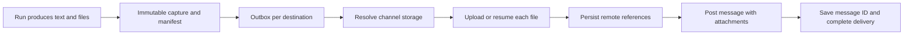

# Future Design: Native Attachments in Teams Channels

**Status:** reference for a future extension; outside the first iteration and not implemented.  
**Date:** 2026-09-27.  
**Complements:** [Output Providers](rfc-scheduled-task-output-providers.md).  
**Future scope studied:** send files as native attachments, available in the channel without opening Mattin AI.

> Current decision: the first iteration will post a Workflows Adaptive Card with links to authenticated Mattin AI resources. The previous native-attachment requirement has been relaxed. This document preserves the study for a possible extension; its permissions, models, uploads, and tests are not requirements of the current iteration.

## 1. Decision and effect on the previous design

Recommend `teams_channel`: capture files from each run, upload them to the channel's SharePoint, and post a Teams message with native references to those files through Microsoft Graph. Delegated authorization is the path studied for a future attachment mode. This alternative does not replace the link-card provider selected for the first iteration.

Teams stores the file outside the message; a native attachment is a reference to that file. A link to Mattin AI in a card is not enough. Graph documents posting channel messages with `contentType: reference` attachments, a SharePoint URL, and the corresponding marker in the body. [Official example](https://learn.microsoft.com/en-us/graph/api/chatmessage-post?view=graph-rest-1.0#example-4-send-a-message-with-file-attachment-in-it).

## 2. Delivery sequence



1. Enumerate only `run.output_files` and resolve references within the task session and its conversation. Do not send every file from a continuous conversation.
2. Copy the bytes to durable, immutable storage for the run; record name, MIME type, size, and SHA-256. Save the manifest and deliveries in the completion transaction. File preparation and the database are not part of a shared transaction: use temporary writes and atomic rename/finalization, then clean up copies without a manifest.
3. Resolve the channel's actual location and verify access. Upload files to a dedicated subfolder, for example `MattinAI/{app_id}/{task_id}/{run_id}/{delivery_id}/`; include file_id in the physical name to avoid collisions and retain a human-readable name.
4. Save a checkpoint for each file: driveId, itemId, remote name, size, attachment-compatible URL, and status. Do not post until every required file is complete.
5. Build a message with sanitized text, one marker per file, and the attachments array. Transform `file://` references into references to the corresponding attachment.
6. Post the message and save its ID and URL; Graph `201 Created` confirms creation, not that recipients have read it. [Endpoint and response](https://learn.microsoft.com/en-us/graph/api/channel-post-messages?view=graph-rest-1.0).

## 3. Microsoft Graph location and operations

### Resolve storage

```http
GET /v1.0/teams/{team_id}/channels/{channel_id}/filesFolder
```

The response provides the location's driveItem and `parentReference.driveId`. Persist the drive and folder/item ID. Do not infer `Shared Documents/{channel_name}`: the location can vary for private channels and after migrations. [filesFolder](https://learn.microsoft.com/en-us/graph/api/channel-get-filesfolder?view=graph-rest-1.0).

If the folder has not been provisioned or an error occurs, show the error when testing the destination; do not upload to another drive's root as a fallback. For private/shared channels, validate the corresponding site and identity membership in the pilot; do not assume that team permissions grant access to all its sites.

### Upload bytes

```http
PUT /v1.0/drives/{drive_id}/items/{folder_id}:/{encoded_filename}:/content
```

Graph supports up to 250 MB for a simple upload. That limit applies to the endpoint, not to notification size. [Simple upload](https://learn.microsoft.com/en-us/graph/api/driveitem-put-content?view=graph-rest-1.0).

For a future attachment mode, also implement resumable upload sessions to avoid repeating complete transfers:

```http
POST /v1.0/drives/{drive_id}/items/{folder_id}:/{encoded_filename}:/createUploadSession
PUT {upload_url}
Content-Range: bytes {start}-{end}/{total}
```

Use sequential fragments, with a size that is a multiple of 320 KiB except for the final fragment, and less than 60 MiB per request. Track `nextExpectedRanges` and expiration; if the session expires, reconcile the remote file and open a new session. Do not add a Graph Bearer token to the pre-authorized upload URL; protect that URL as a secret. [Upload sessions](https://learn.microsoft.com/en-us/graph/api/driveitem-createuploadsession?view=graph-rest-1.0).

Initial product proposal: maximum 10 files, 50 MiB per file, and 100 MiB per delivery, configurable and explicit in the UI. These are proposed Mattin AI limits, not Teams limits. Reject excess with a diagnostic; do not truncate files or replace them with links. Avoid reading all binaries into memory: transfer as streams/fragments.

### Build the message with attachments

Fetch the remote metadata required by the documented variant: the file GUID present in `eTag` and `webDavUrl`, which requires explicit selection. Do not use an opaque itemId as a GUID or automatically substitute `webUrl`, a download URL, or an attachment URL for one another. The alternative official example accepts a GUID and a share link with appropriate permissions; do not create public links to work around permissions.

```http
GET /v1.0/drives/{drive_id}/items/{item_id}?$select=id,name,eTag,webDavUrl
POST /v1.0/teams/{team_id}/channels/{channel_id}/messages
Content-Type: application/json
```

```json
{
  "body": {
    "contentType": "html",
    "content": "Daily report available. <attachment id=\"153fa47d-18c9-4179-be08-9879815a9f90\"></attachment>"
  },
  "attachments": [
    {
      "id": "153fa47d-18c9-4179-be08-9879815a9f90",
      "contentType": "reference",
      "contentUrl": "https://contoso.sharepoint.com/sites/Team/Shared%20Documents/General/Report.xlsx",
      "name": "Report.xlsx"
    }
  ]
}
```

Illustrative example; obtain IDs/URLs from the actual resource. Add one marker and reference per file, escaping text and names for HTML. Post one message per delivery within the configured budget; exceeding that budget would produce an explicit error in the future attachment mode, without silently splitting the delivery.

## 4. Authentication: separate files and messages

| Operation | Proposed initial path | Condition |
|---|---|---|
| Resolve folder and upload | Delegated Graph token with `Files.ReadWrite.All` as the practical permission set documented for both endpoints | The identity can access the folder and the tenant allows consent. Broad scope: evaluate Selected permissions during provisioning. |
| Post an ordinary message | Delegated Graph token with `ChannelMessage.Send` | Identity is a member or otherwise authorized in the channel. |
| Maintain scheduled execution | Authorization Code, PKCE, and `offline_access`, with secure token-cache storage | Initial interactive authorization and possible future reconnection due to revocation/Conditional Access. |

A Microsoft 365 connection can be explicitly shared per app/destination among destinations in the same tenant. Mattin AI's LOCAL/OIDC login does not replace this connection. Prefer an operational identity maintained by the customer, with an appropriate license and Teams access, over relying on each task creator. Messages will appear under the delegated identity.

Use OAuth and a standard-library token cache; do not store passwords or use ROPC. Encrypt the cache, serialize updates across workers, and renew with a margin; `interaction_required` marks the connection as needing reconnection, without rerunning the agent. [Authorization Code and refresh tokens](https://learn.microsoft.com/en-us/entra/identity-platform/v2-oauth2-auth-code-flow).

For uploads, a service app with `Sites.Selected` and a write grant to the specific site can be separated out. Selected permissions require consent and explicit assignment to the resource; their behavior with the chosen endpoints must be tested. Preconfiguring the drive/folder through administrative provisioning can avoid broad discovery with that app. Do not add global permissions for convenience. [Selected permissions](https://learn.microsoft.com/en-us/graph/permissions-selected-overview).

Application credentials for SharePoint do not by themselves authorize ordinary Teams message posting. The standard POST restricts `Teamwork.Migrate.All` to migration. The RSC documentation lists `ChannelMessage.Send.Group`, but end-to-end use with this POST requires a pilot and Teams app installation/consent; do not assume it is an already-validated app-only solution. [RSC permissions](https://learn.microsoft.com/en-us/microsoftteams/platform/graph-api/rsc/resource-specific-consent).

## 5. Alternative for keeping Workflows

If the publishing identity must be managed in Power Automate: upload from the backend to SharePoint and call a managed workflow that posts the Graph JSON with native references using the “Send a Microsoft Graph HTTP request” action. The connector documents that action and an arbitrary body, but its connection's effective permissions and the POST must be verified in the tenant before adopting it. [Graph HTTP action](https://learn.microsoft.com/en-us/connectors/teams/#send-a-microsoft-graph-http-request).

The simple Adaptive Card webhook template does not document support for receiving `reference` attachments. The workflow needs its own versioned contract (an appropriate HTTP trigger), a fixed channel, and validation that references belong to an allowed site; do not pass the native-attachment payload to the card trigger assuming compatibility.

Require a final receipt with `message_id` through a controlled synchronous response or authenticated/correlated callback; trigger acceptance does not confirm the requirement. Disable blind POST retries and apply the same uncertainty handling. Account for ownership/co-owners, connections, DLP policies, action/license availability, and an endpoint reachable for the receipt.

This option moves OAuth management into the workflow; it does not eliminate the publishing identity or its permissions. There is no need to implement both paths in the attachment extension: delegated Graph is the path studied; replace it with this bridge only after validating native attachments and confirmation in the pilot.

A bot does not avoid uploading to SharePoint: Teams file-consent APIs only apply to personal chat. [Bot file scope](https://learn.microsoft.com/en-us/microsoftteams/platform/bots/how-to/bots-filesv4).

## 6. Fit with existing files

[FileManagementService](../../backend/services/file_management_service.py) loads metadata from disk when listing by session; `get_file_reference(file_id)` is not a durable, task-isolated resolver. Propose a `snapshot_run_files(task, run)` method that filters `output_files` IDs, validates ownership, and reads only authorized bytes under that conversation's storage. Do not ask the dispatcher to download public signed URLs from the router.

`output_files` retains IDs/names/types, not bytes or an immutable snapshot. `_save_session_files` uses the visible name in the conversation folder: in continuous mode, a name can be overwritten between runs. Capture before another execution can modify those bytes, using a conversation-level lock or versioned source storage; copying a manifest after the race does not solve it. Capture can happen when the file is produced within the agent's durable step, using a stable execution key; recover that manifest if the workflow repeats.

Add durable artifact storage separate from the sandbox's temporary storage, accessible to all workers. This can be a shared volume with atomic writes or object storage. Validate the path, ownership, and symlinks during capture; adapters receive an authorized handle/stream, never a path chosen by the LLM. MIME type and size metadata do not replace reading the actual bytes.

[GraphClient](../../backend/services/sharepoint/graph_client.py) already implements client credentials and read/sync. Reuse its HTTP/application-auth foundation for the upload variant; it needs new folder, upload, metadata, and reconciliation methods. Do not reuse `get_token` for delegated messages: that requires another OAuth strategy. Keep output credentials separate from `SharePointSource`, which is tied to an ingestion silo.

Pruning in [ScheduledTaskService](../../backend/services/scheduled_task_service.py) removes runs/files. [file_cleanup_worker](../../backend/services/file_cleanup_worker.py) also removes metadata by TTL without checking deliveries. The output spool needs its own lifecycle: protect it by manifest and do not depend on temporary sidecars surviving.

## 7. Model, retries, and lifecycle

- `OutputArtifact`: execution, original file_id, name/MIME type, bytes, hash, and durable key. Unique per execution/file_id; capture is shared across destinations.
- `OutputDeliveryArtifact`: delivery/artifact, deterministic remote name, status, driveId/itemId, eTag/URL, protected upload session, and checkpoint. Unique per delivery/artifact.
- Preparation status per delivery: validation, upload, message preparation, and posting. Keep the overall status separate from the agent.

Retry each file independently. If the second fails, reuse the first one already uploaded and do not post yet. If an upload response is lost, reconcile by deterministic location and metadata; verify remote content if identity is inconclusive. Do not automatically rename or overwrite files owned by others. Paths are dedicated to the delivery; name/size alone do not prove equality.

A POST timeout can mean the message was created without a receipt: mark it `unknown`, retain references, and allow explicit resolution/resend. Resending reuses files; it does not create new copies. Do not broaden message-read permissions solely for heuristic deduplication that offers no guarantee.

Capture and upload can leave orphaned objects. Reconcile manifests/database records and clean up expired failed uploads only when publication is no longer possible; respect corporate retention. Do not delete remote files while status is `unknown`.

After posting, the SharePoint copy has retention independent of `max_runs_retained`; pruning Mattin AI does not break the external attachment. Define remote retention per destination. In the attachment extension, retain according to SharePoint policy and audit uploads; do not cascade deletion when an app/task is removed. Cancel pending deliveries and handle incomplete artifacts. External deletion/revocation requires a dedicated process and permissions.

## 8. Configuration and acceptance for the future attachment mode

Destination: tenant, authorized connection, team/channel IDs, resolved drive/folder, subfolder, file/size policy, and retention. Changing the channel/storage creates an explicit revision without redirecting pending deliveries. Inherit the channel storage permissions; do not use anonymous links. Private/shared subfolders require their actual site and membership.

Task: send all output files by default, with `required` policy; use explicit filters if the business needs them. If files are required, do not allow `link_only` as a substitute or save a provider without attachment capability. If there are no files and no report is expected, send a normal message. If the expected report is missing, return an explicit delivery error.

UI: connection/folder validation, “Test with file,” N/M progress, per-file errors, posting failure, and “Reconnect Microsoft 365.” Show `delivered` only after the final receipt. An authorized destination test from the UI creates a clearly identified file and posts a message with an attachment; record both IDs and its cleanup policy.

Criteria that must pass before release:

1. Generated PDF and XLSX files appear as native message attachments in channel storage and can be opened/downloaded by a member without a Mattin AI session; bytes match the snapshot.
2. Two files, same visible name, and a continuous conversation: each run delivers its correct version, even with a delayed worker.
3. Mid-upload failure, restart, expired session, and lost response: recovery does not rerun the agent or duplicate remote files.
4. Failure of one file prevents posting an incomplete result; retry reuses completed files.
5. Successful upload and failed POST: status remains pending/failed and success is not reported. Ambiguous POST: `unknown`, with no automatic retry.
6. OAuth revocation, 401/403, and throttling: diagnostic, reconnection/Retry-After; destinations and executions remain independent.
7. Limits, Unicode, conflicting names, MIME type, app isolation, and foreign paths: validate without silently omitting files.
8. Local retention, run pruning, and temporary cleanup do not delete pending bytes. After posting, pruning the run does not break the SharePoint file.
9. Standard channel in the pilot; private/shared channels required by the deployment must pass the same storage, posting, and access tests.

Feasibility is supported by documented APIs; consent, operational identity, and tenant policies still need verification, along with attachment rendering in the Teams clients in use. This document updates the analysis; it does not implement the provider or publish real files.
